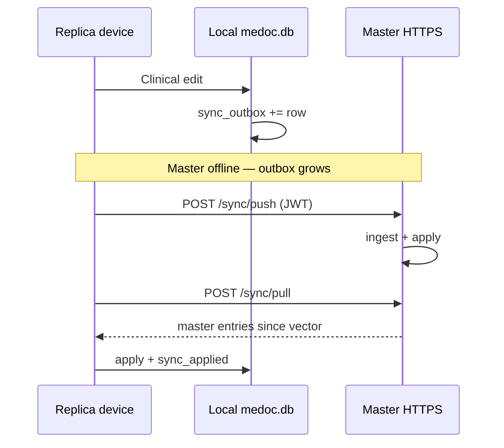

# Serverless peer sync

**Last updated:** 2026-05-26  
**Crate:** `crates/medoc-sync`  
**HTTP surface:** `POST/GET /api/v1/sync/{push,pull,status}` and
`/api/v1/pairing/{request,status,master-info,decide,revoke,pending,peers}` on
the LAN router (`medoc-lan`).

## Problem

Practices need:

1. **Offline editing** on a secondary device when the master workstation is down.
2. **Bidirectional sync** when connectivity returns — without mandating a always-on `medoc-server` for every device.
3. **Clear conflict rules** for regulated clinical data.

## Design (chosen approach)

| Layer | Mechanism |
|-------|-----------|
| Storage | SQLCipher `medoc.db` per device |
| Change capture | Append-only **`sync_outbox`** (per-device monotonic `seq`) |
| Ordering | Per-device sequence + **`sync_vector`** table |
| Idempotency | **`sync_applied (source_device_id, source_seq)`** |
| Transport | HTTPS to master’s LAN API (self-signed TLS + optional fingerprint pin) |
| Auth (replica → master) | Ed25519-signed **activation token** (`mt2.<payload>.<sig>`) issued at pairing time. Legacy JWT still accepted for installs paired before Slice 4. |
| Conflicts | **`ConflictPolicy::MasterWinsWithFreshness`** — if both rows carry a parsable `updated_at`, the newer wins; ties go to the master. Missing timestamps fall back to legacy master-wins. |

This is an **outbox + master/replica** pattern (not full CRDT). It matches clinical “one authoritative practice host” better than last-writer-wins everywhere.

### Why not pure P2P mesh?

- Medical audit expectations favour a **single authoritative device** (master).
- Mesh merge of arbitrary SQLite rows without domain rules is high-risk.
- Master exposes existing **TLS + JWT** stack; replicas reuse LAN login for `master_access_token`.

### Offline flow

## Schema (practice DB)

Created by `ensure_sync_replication_tables` in `medoc-core` migrations:

- `sync_device` — registry (local + peers)
- `sync_vector` — last seq per device
- `sync_outbox` — pending mutations
- `sync_applied` — dedupe remote ops

## Allow-listed entities (v1)

`merge.rs` only applies:

`patient`, `patientenakte`, `termin`, `behandlung`, `untersuchung`, `zahlung`, `app_kv`, `praxis_aufgabe`

Extend deliberately with domain review — not open SQL.

## Configuration (`app_kv` `sync.deployment.v1`)

| Field | Purpose |
|-------|---------|
| `mode` | `serverless_peer` |
| `role` | `MASTER` \| `REPLICA` |
| `masterBaseUrl` | e.g. `https://192.168.1.10:8787` |
| `activationToken` | `mt2.<payload>.<sig>` from master pairing (preferred). |
| `masterPubkey` | Master Ed25519 public key (base64 no-pad) — replicas pin it. |
| `masterDeviceId` | Master device UUID, learned during pairing. |
| `pairingRequestId` | Original pairing request id, kept for audit. |
| `masterAccessToken` | **Deprecated** legacy JWT; still consumed if activation token is empty. |
| `masterCertSha256` | Optional cert pin |
| `deviceLabel` | UI label |
| `unstableMesh` | If true, opts in to BEST-EFFORT mesh fan-out (`SyncEngine::run_mesh_sync`). |

## Pairing handshake (Slice 2/3)

| Step | Replica | Master |
|------|---------|--------|
| 1 | `POST /api/v1/pairing/request` with own `device_id`, `slave_pubkey`, label, LAN IP. | Persists row in `pairing_request` (`status='PENDING'`). |
| 2 | Polls `GET /api/v1/pairing/status/{id}` until non-PENDING. | Master operator (`ops.system` RBAC) opens the Einstellungen → Pairing inbox view. |
| 3 | — | Calls `POST /api/v1/pairing/decide/{id}` with `accept`, `allowed_actions[]`. On accept, master mints an activation token signed by its keypair (`medoc-sync::master_keys`) and stores it in `pairing_request.activation_token`. Per-slave `slave_permission` rows are inserted. |
| 4 | Persists token + master pubkey via `sync_set_deployment`. | — |
| 5 | Replica calls `/sync/push|pull` with `Authorization: Bearer mt2.…`. | LAN JWT middleware short-circuits to `verify_activation_for_path` (Ed25519 + per-slave allow-list re-check against `slave_permission`). |

The signing keypair lives in the OS keychain (or `MEDOC_MASTER_SIGNING_KEY`
env override for headless tests). `master_keys::load_or_create` is the only
caller that persists; cargo unit tests use a deterministic dev seed.

### Per-slave RBAC

- Activation-token allow-list is checked **only** on `/sync/push`,
  `/sync/pull`, `/sync/status`, and `/pairing/peers`. Other protected
  routes reject `mt2.*` bearers with HTTP 403 and require a legacy JWT.
- Master can revoke a slave with `POST /api/v1/pairing/revoke/{device_id}`
  which deletes its `slave_permission` rows and marks the pairing as
  `REVOKED`. Subsequent token use yields HTTP 403 (`action revoked`).

## IPC (desktop)

- `sync_get_status`
- `sync_set_deployment`
- `sync_run_now` — replica push + pull
- `sync_record_change` — optional explicit outbox append
- `pairing_list_pending`, `pairing_decide`, `pairing_revoke`, `pairing_master_info` — master inbox
- `pairing_scan_lan`, `pairing_submit_request`, `pairing_check_status`,
  `pairing_persist_token` — replica scan/request flow

## Automatic outbox hooks (Slice 5)

Each allow-listed write path in `medoc-core::infrastructure::database::*_repo`
calls `crate::infrastructure::database::sync_outbox::record_or_noop(pool,
table, id, op, payload_json)` immediately before returning success. The
helper:

1. No-ops when `sync.deployment.v1` is absent or `mode != serverless_peer`.
2. No-ops when the table is not in `sync_outbox::SYNCED_TABLES`.
3. Otherwise bumps the local device's `sync_vector` and appends one
   `sync_outbox` row containing the serialised entity JSON.

For `app_kv`, the hook **excludes** internal sync/license/pairing keys
(prefix `sync.`, `license.`, `pairing.`) so the master's device id and
license envelope do not replicate. The op label is mapped to `UPDATE` for
upserts to satisfy the existing `sync_outbox.op` CHECK constraint.

Test coverage: `crates/medoc-core/tests/sync_outbox_hooks_tests.rs`
(7 tests) and `medoc_core::infrastructure::database::sync_outbox::tests`.

## Conflict resolution (Slice 6)

`ConflictPolicy::MasterWinsWithFreshness` reads `updated_at` from both the
local row (`SELECT updated_at FROM {table} WHERE id = ?`) and the inbound
payload (`obj["updated_at"]`):

| Local `updated_at` | Remote `updated_at` | Outcome |
|--------------------|---------------------|---------|
| present, newer | present, older | Local kept (`SKIP_STALE_REMOTE`). |
| present, older | present, newer | Remote applied. |
| present, equal | present, equal | Master wins (replica accepts; master keeps own). |
| missing on either side | missing on either side | Legacy master-wins (replica keeps local). |

Tests live in `medoc_sync::engine::tests` —
`master_does_not_overwrite_newer_replica_row` and
`newer_master_push_overwrites_older_replica_row`.

## Mesh sync (BEST-EFFORT, behind `unstable_mesh`)

- Master serves a signed peer list at `GET /api/v1/pairing/peers` (Ed25519
  signature in the response body).
- `SyncEngine::run_mesh_sync` reads the deployment's `unstable_mesh` flag,
  fetches `/pairing/peers`, then POSTs the replica's pending outbox to each
  peer that advertises a `peer_base_url` in `sync_device`.
- Per-peer `delivered_at` bookkeeping is **NOT** wired (the canonical
  master push still owns delivery). Signature verification of the peer
  list is **NOT** wired yet either; reused public key is available via
  `master_keys::pubkey_b64`.
- Live two-replica verification is **DEFERRED**; scaffolding exists.

## Future work (not in v1)

- mDNS pairing instead of pasted URL + token
- Signed payload verification on the mesh peer list response
- Per-peer delivered_at tracking once live mesh validation completes
- Company-server multi-praxis federation
- Migration of repositories beyond the 8 allow-listed tables
