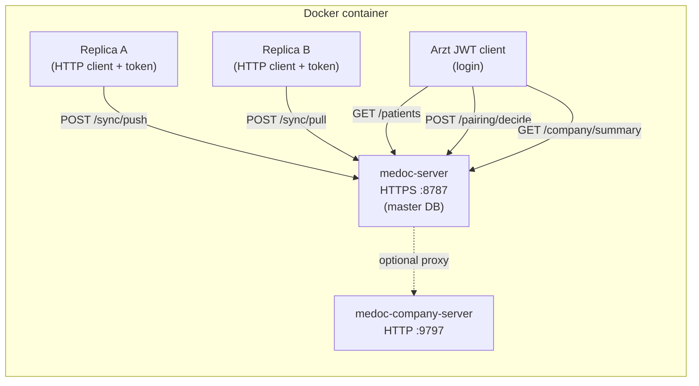

# Multi-device port-based API catalog

**Purpose:** Document HTTP surfaces exercised by `scripts/validate-docker-multi-device.sh` — real TCP ports, real `medoc-server` / `medoc-company-server` binaries, simulated replica devices via activation tokens.

**Orchestrator:** `docker/ci/run-multi-device-port-e2e.sh`  
**Tests:** `crates/test/medoc-e2e/tests/multi_device_port_http.rs`  
**Default ports:** master HTTPS `8787`, company HTTP `9797`

---

## Topology (serverless + serverful)



| Role | Process | Port | Protocol |
| ---- | ------- | ---- | -------- |
| Master (LAN server) | `medoc-server` | 8787 | HTTPS (self-signed) |
| Company portal | `medoc-company-server` | 9797 | HTTP |
| Replica device A/B | Test process (`reqwest`) | — | Client only |
| Practice admin (Arzt) | Test process (`reqwest`) | — | JWT after login |

---

## medoc-server (LAN) — `/api/v1`

### Public (no auth)

| Method | Path | Request | Response (key fields) | Test |
| ------ | ---- | ------- | --------------------- | ---- |
| GET | `/health` | — | `{ "status": "ok", "service": "medoc-lan" }` | `port_master_public_health_and_master_info` |
| GET | `/api/v1/ping` | — | `{ "ok": true }` | same |
| GET | `/api/v1/pairing/master-info` | — | `{ "masterPubkey": "…" }` | same |
| POST | `/api/v1/pairing/request` | `{ deviceId, slavePubkey, slaveLabel }` | `{ id, status: "PENDING" }` | `port_two_replicas_pair_push_patient_master_lists` |
| GET | `/api/v1/pairing/status/{id}` | — | `{ status }` | `port_pairing_status_transitions_pending_to_accepted` |

### JWT auth (practice login)

| Method | Path | Request | Response | Test |
| ------ | ---- | ------- | -------- | ---- |
| POST | `/api/v1/auth/login` | `{ email, password, totp_code }` | `{ access_token }` | `port_master_jwt_login_and_me` |
| GET | `/api/v1/me` | `Authorization: Bearer <jwt>` | `{ email, role }` | same |
| GET | `/api/v1/patients` | JWT | `[{ id, name, … }]` | `port_two_replicas_…` (after sync push) |
| POST | `/api/v1/pairing/decide/{id}` | `{ accept: true }` + JWT | `{ status: "ACCEPTED", activationToken }` | pairing tests |
| POST | `/api/v1/pairing/revoke/{device}` | JWT | 204 | `port_revoked_replica_push_forbidden` |
| GET | `/api/v1/company/summary` | JWT (`ops.system`) | subscription summary JSON | `port_practice_proxy_company_summary_via_lan` |

### Activation token auth (replica / serverless peer)

| Method | Path | Request | Response | Test |
| ------ | ---- | ------- | -------- | ---- |
| GET | `/api/v1/sync/status` | Bearer `mt2.…` | `{ localDeviceId, vectors, … }` | `port_master_sync_status_and_signed_peers` |
| POST | `/api/v1/sync/push` | `{ fromDeviceId, entries[] }` | `{ accepted: N }` | `port_two_replicas_…` |
| POST | `/api/v1/sync/pull` | `{ deviceId, sinceSeq }` | `{ entries[] }` | same (replica B pulls patient) |
| GET | `/api/v1/pairing/peers` | Bearer token | `{ signature, peers[] }` | `port_master_sync_status_and_signed_peers` |

**Outbox entry shape (patient INSERT):** `entity_table: "patient"`, `op: "INSERT"`, `payload_json` with full patient row (see `port_client::patient_insert_entry`).

### SyncEngine (serverless client stack over real HTTPS)

| Flow | API / engine | Test |
| ---- | ------------ | ---- |
| Replica local outbox → master DB | `SyncEngine::push_to_master` → `POST /sync/push` | `port_sync_engine_push_to_master_propagates_patient` |
| Master outbox → replica local DB | `SyncEngine::pull_from_master` → `POST /sync/pull` | `port_sync_engine_pull_from_master_applies_to_replica_db` |
| Replica A outbox → replica B DB (mesh) | `SyncEngine::run_mesh_sync` → peer `POST /sync/push` | `port_mesh_sync_delivers_app_kv_to_peer_replica` (incl. idempotent re-run) |
| Tier-1 `prescription` push | `POST /sync/push` activation token | `port_sync_rezept_push_applies_on_master` |
| Tier-1 `practice_ticket` push | `POST /sync/push` activation token | `port_sync_praxis_ticket_push_applies_on_master` |
| Freshness conflict on master | two `POST /sync/push` with competing `updated_at` | `port_two_replicas_freshness_conflict_over_https` |
| Token/device binding | `POST /sync/push` with wrong `fromDeviceId` | `port_push_spoofed_from_device_id_forbidden` |

Master seed for pull tests: `prepare_master_data_dir` sets `serverless_peer` MASTER role and creates `PORT_MASTER_SEED_PATIENT_NAME` via `patient_repo::create` (outbox hook).

Mesh topology: orchestrator exports `MEDOC_MASTER_DATA_DIR`; test spawns replica `medoc-server` on `:8788` / `:8789` and patches `sync_device.peer_base_url` on the master DB.

---

## medoc-company-server

| Method | Path | Headers | Response | Test |
| ------ | ---- | ------- | -------- | ---- |
| GET | `/health` | — | `{ "service": "medoc-company-server", "_demo": true, "banner": "…" }` | `port_company_server_health_and_practice_api` |
| GET | `/v1/summary` | `X-Practice-Slug`, `Authorization: Bearer sk_…` | `{ practice_slug, display_name, … }` | same |
| GET | `/v1/feature-flags` | same | `{ _demo: true, … }` | in-process `company_portal.rs` |
| GET | `/v1/integrations/status` | same | integrations JSON | in-process |
| POST | `/v1/billing/payment-methods` | same | billing stub | in-process |

Demo credentials: slug `demo-praxis`, key `sk_demo_company_practice_key`.

---

## Environment variables (orchestrator)

| Variable | Default | Purpose |
| -------- | ------- | ------- |
| `MEDOC_MASTER_URL` | `https://127.0.0.1:8787` | Tests target master |
| `MEDOC_COMPANY_URL` | `http://127.0.0.1:9797` | Company server |
| `MEDOC_MASTER_DATA_DIR` | (temp) | Master DB path — mesh tests patch peer URLs |
| `MEDOC_REPLICA_A_PORT` | `8788` | Mesh replica A HTTPS |
| `MEDOC_REPLICA_B_PORT` | `8789` | Mesh replica B HTTPS |
| `MEDOC_COMPANY_API_BASE` | `http://127.0.0.1:9797` | Master proxy target — **must be set in master process env before start** |
| `MEDOC_COMPANY_API_KEY` | `sk_demo_company_practice_key` | Master proxy auth — same timing requirement |

Crypto/test keys: `MEDOC_VENDOR_PUBKEY`, `MEDOC_DB_KEY`, `MEDOC_AUDIT_KEY`, `MEDOC_PAIRING_MASTER_SECRET`, `MEDOC_DEV_SEED=1`.

---

## How to run

```bash
# Full Docker pipeline (build + multi-device port e2e)
bash scripts/validate-docker-multi-device.sh

# Or host/Linux with Rust (after cd app)
bash docker/ci/run-multi-device-port-e2e.sh

# Include in standard validate-docker when enabled
VALIDATE_DOCKER_MULTI_DEVICE=1 bash scripts/validate-docker.sh
```

---

## Coverage vs in-process e2e

| Scenario | In-process (`LanHarness`) | Port-based (this suite) |
| -------- | ------------------------- | ------------------------ |
| Pairing + sync | ✓ | ✓ over real HTTPS |
| SyncEngine push/pull | partial (in-process HTTP) | ✓ real `medoc-server` TCP |
| Two-replica mesh | `two_replica_mesh.rs` | ✓ `port_mesh_sync_…` (2 headless servers) |
| TLS / cert generation | simulated | real self-signed cert in data dir |
| Multi-replica mesh TCP | `two_replica_mesh.rs` | ✓ (8788/8789 replicas) |
| UDP discovery :47830 | not tested | not tested |
| Tauri desktop FE | not tested | not tested (backend-only) |

---

## W8 — Two-host live verification (T-S2)

Automated proxy: `bash tools/two-device-sync-smoke.sh` → Docker port suite (16+ tests).

Manual checklist (second device / VM):

1. Master: `medoc-server` + license + pairing inbox accept.
2. Replica: `serverless_peer` + REPLICA role → pairing scan or paste master URL.
3. Create `practice_ticket` + `prescription` on replica → verify on master after sync.
4. Revoke replica → `POST /sync/push` returns 403.

See [`g21-live-smoke-checklist.md`](g21-live-smoke-checklist.md) for Tauri UI rows.

**DB verification:** Port tests assert master-side effects via `GET /api/v1/patients` (JWT) and replica-side via `POST /api/v1/sync/pull` entries — no direct SQLite access from tests when using external binaries.
