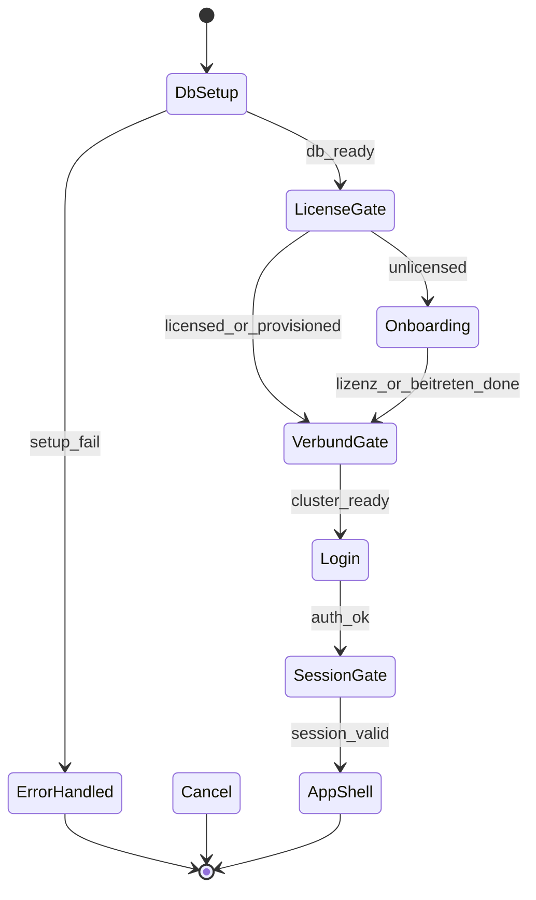

# Workflow map (Phase E)

**Created:** 2026-06-10  
**Plan:** [`refactor-and-harden-plan.md`](refactor-and-harden-plan.md)  
**Scope:** Desktop `apps/practice-host-ui` routes + gates; RBAC via [`packages/shared/src/lib/rbac.ts`](../../packages/shared/src/lib/rbac.ts)

## Terminability legend

| Terminal | Meaning |
| -------- | ------- |
| **Success** | User goal completed; navigates away or sees confirmation |
| **Cancel** | Back, Escape, dialog dismiss, or explicit Abbrechen |
| **Error** | Toast/inline error with next action; user can retry or leave |

## Pre-app gates (ordered)

| Gate | Entry | Terminals | Notes |
| ---- | ----- | --------- | ----- |
| DB setup | First launch | Success → license; Error → retry wizard | [`db-setup-gate.tsx`](../../apps/practice-host-ui/src/views/components/db-setup-gate.tsx) |
| License/pairing | Pre-login | Success → dashboard/onboarding; Cancel → onboarding routes | [`license-and-pairing-gate.tsx`](../../apps/practice-host-ui/src/views/components/license-and-pairing-gate.tsx) |
| Verbund onboarding | `/onboarding/*` | Success → `/login`; Cancel → stay on gate (Link back) | [`verbund-onboarding-gate.tsx`](../../apps/practice-host-ui/src/views/components/verbund-onboarding-gate.tsx) |
| Login | `/login` | Success → `/`; Error → inline message | TOTP branch terminable via back to credentials |
| Session | All protected routes | Redirect `/login` if expired | [`session-gate.tsx`](../../apps/practice-host-ui/src/views/components/session-gate.tsx) |

## Priority workflows

### W-01 Login / session

States: `idle → submitting → totp_enroll? → success | error`  
Terminals: success → `/`; error → stay with message; cancel → clear fields  
RBAC: N/A (pre-auth)

### W-02 Patient anlegen

Route: `/patienten/neu`  
States: `form → submitting → success | validation_error`  
Terminals: success → `/patienten/:id`; cancel → confirm abandon → `/patienten`; error → inline  
Smoke: [`p0-routes.smoke.test.tsx`](../../apps/practice-host-ui/src/p0-routes.smoke.test.tsx)

### W-03 Termin anlegen

Route: `/termine/neu`  
Terminals: success → `/termine`; cancel → back; error → inline  
Loading: `PageLoading` + `PageLoadError` on list parent

### W-04 Patientenakte / export

Route: `/patienten/:id`  
Subflows: akte save confirm, export picker, discharge PDF, workflow dialogs  
Terminals: each dialog `onClose`; export success closes picker; errors → toast  
Smoke: [`export-preview-dialog.smoke.test.tsx`](../../apps/practice-host-ui/src/views/components/export-preview-dialog.smoke.test.tsx), [`patient-akte-workflow-dialogs.smoke.test.tsx`](../../apps/practice-host-ui/src/views/components/patient-akte-workflow-dialogs.smoke.test.tsx)

### W-05 Finanzen / Zahlung

Routes: `/finanzen`, `/finanzen/neu`, `/finanzen/kasse/neu`  
Terminals: save → list; cancel → back; RBAC: `finanzen.read` / `finanzen.write`

### W-06 Praxis-Aufgaben / Tickets

Routes: `/tickets`, `/tickets/neu`, `/tickets/:id/bearbeiten`  
Redirect: `/posteingang` → `/tickets` (terminable redirect)  
Smoke: [`praxis-tickets.smoke.test.tsx`](../../apps/practice-host-ui/src/views/pages/praxis-tickets.smoke.test.tsx)

### W-07 Einstellungen

Route: `/einstellungen` (+ section panels in package)  
Terminals: save per section → toast; nav away → unsaved handled per section  
Smoke: [`einstellungen.rbac.smoke.test.tsx`](../../apps/practice-host-ui/src/views/pages/einstellungen.rbac.smoke.test.tsx)

### W-08 Migration wizard

Route: `/migration`  
Terminals: complete → success summary; cancel → `/`; stub device steps document non-live connectors

### W-09 Verwaltung hub

Route: `/verwaltung` + nested TOC pages  
Legacy redirects terminable: `/verwaltung/tagesabschluss` → finanzen-berichte; `/personal/neu` → query param

## Flag-gated surfaces (not dead ends)

| Flag | Route / nav | Behavior |
| ---- | ----------- | -------- |
| `DATENSCHUTZ_UI_ENABLED=false` | `/datenschutz` | Route exists; nav hidden; page shows gate if navigated directly |
| `POSTEINGANG_UI_ENABLED=false` | `/posteingang` | Redirect to `/tickets` |
| Deferred roles | login | STEUERBERATER/PHARMABERATER rejected at IPC — documented in [`todos-deferred-roles.md`](todos-deferred-roles.md) |

## Register cross-reference (workflow items)

| ID | Status | Action taken |
| -- | ------ | ------------ |
| R-011 | open | G21b manual — not automatable in this pass |
| R-017 | done | Export/report dialogs: mime default + Blob fix; break-glass dismiss key |
| R-001–R-003 | deferred | Geräteverbund wire — feature track |

## 2026-08-25 detection refresh (quality run)

| ID | Workflow surface | Detection | Evidence | Severity | Status |
| -- | ---------------- | --------- | -------- | -------- | ------ |
| WF-2026-08-25-01 | Global FE test workflow | Non-terminable under default runner memory (OOM) during full `vitest run`. | `npm run test` failed with V8 heap OOM after most suites completed. | P1 | **Open** |
| WF-2026-08-25-02 | Auth/session audit path | Rust workspace test gate blocked by ARZT-seat constraint in fixture flow. | `cargo test --workspace --tests` failed at `auth_session_audit_tests` with sqlite code 1811. | P1 | **Open** |
| WF-2026-08-25-03 | Dialog cancel/confirm paths | Escape/backdrop/close and Enter-confirm transitions now explicitly logged and covered. | `dialog.workflow.test.tsx` (packages/ui + app copy) 8 tests pass. | P2 | **Closed** |
| WF-2026-08-25-04 | Login route geometry + a11y | Login workflow route passes spacing token assertions and axe critical scan. | Playwright specs `ui-geometry.spec.ts` and `ui-accessibility.spec.ts` pass. | P2 | **Closed** |

## Route inventory (shell)

Main authenticated routes in [`App.tsx`](../../apps/practice-host-ui/src/App.tsx): dashboard, termine, patienten, tickets, finanzen, bestellungen, bilanz, verwaltung/*, rezepte, atteste, leistungen, produkte, personal, statistik, audit, datenschutz, einstellungen, logs, ops, compliance, hilfe, feedback, migration, akten-zu-validieren.

Onboarding (outside shell): `/onboarding`, `/onboarding/lizenz`, `/onboarding/beitreten`.

All `RoleRoute`-wrapped paths hidden when RBAC denies; direct URL → redirect or empty state per [`role-route.tsx`](../../apps/practice-host-ui/src/views/components/role-route.tsx).
