# Klassendiagramm (Class Diagram) – MeDoc

## Beschreibung
Das Klassendiagramm zeigt die statische Struktur des MeDoc-Systems: alle Domänenklassen mit Attributen, Methoden und Beziehungen (Assoziation, Komposition, Vererbung).

## Vollständiges Klassendiagramm

```mermaid
classDiagram
    direction TB

    %% ============================================================
    %% ENUMERATIONS
    %% ============================================================

    class Rolle {
        <<enumeration>>
        ARZT
        REZEPTION
        STEUERBERATER
        PHARMABERATER
    }

    class Geschlecht {
        <<enumeration>>
        MAENNLICH
        WEIBLICH
        DIVERS
    }

    class PatientStatus {
        <<enumeration>>
        NEU
        AKTIV
        VALIDIERT
        READONLY
    }

    class AkteStatus {
        <<enumeration>>
        NEU
        IN_BEARBEITUNG
        VALIDIERT
        READONLY
    }

    class TerminArt {
        <<enumeration>>
        UNTERSUCHUNG
        BEHANDLUNG
        NOTFALL
    }

    class TerminStatus {
        <<enumeration>>
        ANGEFRAGT
        BESTAETIGT
        DURCHGEFUEHRT
        ABGESCHLOSSEN
        STORNIERT
    }

    class DokumentTyp {
        <<enumeration>>
        ROENTGEN
        LABORBEFUND
        REZEPT
        ATTEST
        QUITTUNG
        SONSTIGES
    }

    class ZahlungStatus {
        <<enumeration>>
        BEZAHLT
        OFFEN
        STORNIERT
    }

    class ZahlungsArt {
        <<enumeration>>
        BAR
        KARTE
        UEBERWEISUNG
    }

    class LieferStatus {
        <<enumeration>>
        BESTELLT
        GELIEFERT
        STORNIERT
    }

    %% ============================================================
    %% DOMAIN CLASSES
    %% ============================================================

    class Personal {
        +String id
        +String name
        +String email
        -String passwort_hash
        +Rolle rolle
        +String? taetigkeitsbereich
        +String? fachrichtung
        +String? telefon
        +bool verfuegbar
        +DateTime created_at
        +DateTime updated_at
        +authenticate(email, passwort) Option~Personal~
        +change_role(neue_rolle: Rolle) Result
        +set_verfuegbar(status: bool) void
        +validate_password(passwort: String) bool
    }

    class Patient {
        +String id
        +String name
        +Date geburtsdatum
        +Geschlecht geschlecht
        +String versicherungsnummer
        +String? telefon
        +String? email
        +String? adresse
        +PatientStatus status
        +DateTime created_at
        +DateTime updated_at
        +get_alter() u32
        +change_status(neuer_status: PatientStatus) Result
        +get_vollstaendiger_name() String
        +has_active_termine() bool
    }

    class Patientenakte {
        +String id
        +String patient_id
        +AkteStatus status
        +String? behandlungsverlauf
        +String? diagnose
        +String? befunde
        +String? notizen
        +String? validiert_von
        +DateTime? validiert_am
        +DateTime created_at
        +DateTime updated_at
        +validieren(arzt_id: String) Result
        +add_befund(befund: String) void
        +set_readonly() void
        +export_pdf() Vec~u8~
    }

    class Termin {
        +String id
        +Date datum
        +String uhrzeit
        +TerminArt art
        +TerminStatus status
        +String? beschwerden
        +String patient_id
        +String arzt_id
        +DateTime created_at
        +DateTime updated_at
        +hat_konflikt(andere_termine: Vec~Termin~) bool
        +change_status(neuer_status: TerminStatus) Result
        +is_heute() bool
        +get_dauer_minuten() u32
    }

    class BlockierteZeit {
        +String id
        +String arzt_id
        +Date datum
        +String von_uhrzeit
        +String bis_uhrzeit
        +String? grund
        +DateTime created_at
        +ueberschneidet(uhrzeit: String) bool
    }

    class Anamnesebogen {
        +String id
        +String patient_id
        +JSON antworten
        +bool unterschrieben
        +DateTime created_at
        +DateTime updated_at
        +is_vollstaendig() bool
        +get_antwort(frage: String) Option~String~
    }

    class Untersuchung {
        +String id
        +String akte_id
        +String? beschwerden
        +String? untersuchungsergebnisse
        +String? diagnose
        +String? bildmaterial
        +DateTime created_at
        +DateTime updated_at
        +hat_diagnose() bool
    }

    class Behandlung {
        +String id
        +String akte_id
        +String? behandlungsart
        +String? verlauf
        +String? materialien
        +String? dokumentation
        +bool? erfolg
        +String? abbruchgrund
        +String? leistung_id
        +DateTime created_at
        +DateTime updated_at
        +is_abgeschlossen() bool
        +mark_erfolg(erfolg: bool) void
    }

    class Zahnbefund {
        +String id
        +String akte_id
        +i32 zahn_nummer
        +String befund
        +String? diagnose
        +String? behandlung
        +String? notizen
        +DateTime created_at
        +DateTime updated_at
        +is_fdi_valid() bool
        +needs_treatment() bool
    }

    class Dokument {
        +String id
        +String akte_id
        +DokumentTyp typ
        +String titel
        +String datei_pfad
        +String? referenz_nr
        +String? tags
        +DateTime created_at
        +get_extension() String
        +get_size_bytes() u64
    }

    class Zahlung {
        +String id
        +String patient_id
        +f64 betrag
        +ZahlungsArt zahlungsart
        +ZahlungStatus status
        +String? beschreibung
        +String? leistung_id
        +DateTime created_at
        +DateTime updated_at
        +mark_bezahlt() Result
        +stornieren() Result
        +format_betrag() String
    }

    class Finanzdokument {
        +String id
        +String typ
        +f64 betrag
        +String? kategorie
        +String? beschreibung
        +String? zeitraum
        +DateTime created_at
        +is_einnahme() bool
    }

    class Leistung {
        +String id
        +String name
        +String kategorie
        +f64 preis
        +bool aktiv
        +DateTime created_at
        +DateTime updated_at
        +deactivate() void
        +format_preis() String
    }

    class Produkt {
        +String id
        +String name
        +String lieferant
        +i32 menge
        +LieferStatus lieferstatus
        +String? hersteller
        +f64? preis
        +DateTime created_at
        +DateTime updated_at
        +is_verfuegbar() bool
        +mark_geliefert() void
    }

    class ExternerPartner {
        +String id
        +String typ
        +String firmenname
        +String? personenname
        +String? taetigkeitsbereich
        +String? email
        +String? telefon
        +bool verfuegbar
        +DateTime created_at
        +DateTime updated_at
    }

    class AuditLog {
        +String id
        +String user_id
        +String action
        +String entity
        +String? entity_id
        +String? details
        +DateTime timestamp
    }

    %% ============================================================
    %% RELATIONSHIPS
    %% ============================================================

    %% Composition (starke Zugehörigkeit)
    Patient "1" *-- "1" Patientenakte : besitzt
    Patient "1" *-- "0..1" Anamnesebogen : hat
    Patientenakte "1" *-- "0..*" Untersuchung : enthält
    Patientenakte "1" *-- "0..*" Behandlung : enthält
    Patientenakte "1" *-- "0..*" Zahnbefund : enthält
    Patientenakte "1" *-- "0..*" Dokument : enthält

    %% Association (Beziehung)
    Patient "1" -- "0..*" Termin : hat
    Patient "1" -- "0..*" Zahlung : zahlt
    Personal "1" -- "0..*" Termin : behandelt
    Personal "1" -- "0..*" BlockierteZeit : blockiert
    Personal "1" -- "0..*" AuditLog : erzeugt

    %% Dependency (optionale Referenz)
    Behandlung "0..*" ..> "0..1" Leistung : referenziert
    Zahlung "0..*" ..> "0..1" Leistung : für

    %% Enum usage
    Personal ..> Rolle
    Patient ..> Geschlecht
    Patient ..> PatientStatus
    Patientenakte ..> AkteStatus
    Termin ..> TerminArt
    Termin ..> TerminStatus
    Dokument ..> DokumentTyp
    Zahlung ..> ZahlungStatus
    Zahlung ..> ZahlungsArt
    Produkt ..> LieferStatus
```

## Legende

| Symbol | Bedeutung |
|--------|-----------|
| `*--` | Komposition (Teil kann nicht ohne Ganzes existieren) |
| `--` | Assoziation (eigenständige Beziehung) |
| `..>` | Abhängigkeit (optionale Referenz) |
| `+` | Public |
| `-` | Private |
| `<<enumeration>>` | Aufzählungstyp |
