# Use-Case-Diagramm (Use Case Diagram) – MeDoc

## Beschreibung
Definiert die Systemfunktionalität aus Benutzersicht. Zeigt Akteure (4 Rollen) und ihre Anwendungsfälle.

## Gesamtübersicht

```mermaid
graph TB
    subgraph Akteure
        ARZT["🩺 Arzt"]
        REZ["📋 Rezeption"]
        STB["📊 Steuerberater"]
        PHB["💊 Pharmaberater"]
    end

    subgraph "MeDoc – Praxismanagementsystem"
        subgraph "Terminverwaltung"
            UC_TERM_1["UC-01: Termin anlegen"]
            UC_TERM_2["UC-02: Termin bearbeiten/stornieren"]
            UC_TERM_3["UC-03: Tagesplan einsehen"]
            UC_TERM_4["UC-04: Konflikterkennung"]
            UC_TERM_5["UC-05: Notfalltermin anlegen"]
        end

        subgraph "Patientenverwaltung"
            UC_PAT_1["UC-06: Patient anlegen"]
            UC_PAT_2["UC-07: Patient suchen"]
            UC_PAT_3["UC-08: Patientendaten bearbeiten"]
            UC_PAT_4["UC-09: Patientenakte öffnen"]
        end

        subgraph "Medizinische Dokumentation"
            UC_MED_1["UC-10: Untersuchung dokumentieren"]
            UC_MED_2["UC-11: Behandlung dokumentieren"]
            UC_MED_3["UC-12: Zahnschema bearbeiten"]
            UC_MED_4["UC-13: Anamnesebogen erfassen"]
            UC_MED_5["UC-14: Akte validieren"]
            UC_MED_6["UC-15: Dokument hochladen"]
        end

        subgraph "Finanzverwaltung"
            UC_FIN_1["UC-16: Zahlung erfassen"]
            UC_FIN_2["UC-17: Zahlungsstatus ändern"]
            UC_FIN_3["UC-18: Bilanz einsehen"]
            UC_FIN_4["UC-19: Finanzstatistik anzeigen"]
        end

        subgraph "Leistungen & Produkte"
            UC_LEIST_1["UC-20: Leistung anlegen/bearbeiten"]
            UC_PROD_1["UC-21: Produkt bestellen"]
            UC_PROD_2["UC-22: Produktkatalog einsehen"]
        end

        subgraph "Administration"
            UC_ADM_1["UC-23: Personal anlegen/bearbeiten"]
            UC_ADM_2["UC-24: Rollen zuweisen"]
            UC_ADM_3["UC-25: Audit-Log einsehen"]
            UC_ADM_4["UC-26: Statistik-Dashboard"]
            UC_ADM_5["UC-27: Am System anmelden"]
        end
    end

    ARZT --> UC_TERM_1 & UC_TERM_2 & UC_TERM_3 & UC_TERM_5
    ARZT --> UC_PAT_1 & UC_PAT_2 & UC_PAT_3 & UC_PAT_4
    ARZT --> UC_MED_1 & UC_MED_2 & UC_MED_3 & UC_MED_4 & UC_MED_5 & UC_MED_6
    ARZT --> UC_FIN_1 & UC_FIN_2 & UC_FIN_3 & UC_FIN_4
    ARZT --> UC_LEIST_1 & UC_PROD_1 & UC_PROD_2
    ARZT --> UC_ADM_1 & UC_ADM_2 & UC_ADM_3 & UC_ADM_4 & UC_ADM_5

    REZ --> UC_TERM_1 & UC_TERM_2 & UC_TERM_3
    REZ --> UC_PAT_1 & UC_PAT_2 & UC_PAT_3 & UC_PAT_4
    REZ --> UC_MED_4
    REZ --> UC_FIN_1
    REZ --> UC_ADM_5 & UC_ADM_4

    STB --> UC_FIN_3 & UC_FIN_4
    STB --> UC_ADM_5

    PHB --> UC_PROD_2
    PHB --> UC_ADM_5
```

## Detaillierte Use Cases

### UC-01: Termin anlegen

| Feld | Beschreibung |
|------|-------------|
| **Akteur** | Arzt, Rezeption |
| **Vorbedingung** | Benutzer angemeldet, Patient existiert |
| **Hauptszenario** | 1. Patient auswählen 2. Datum/Uhrzeit wählen 3. Terminart wählen 4. Arzt zuweisen 5. Speichern |
| **Alternativszenario** | 4a. Konflikt erkannt → Fehlermeldung → anderes Zeitfenster wählen |
| **Nachbedingung** | Termin gespeichert mit Status ANGEFRAGT, Audit-Log geschrieben |
| **Includes** | UC-04 (Konflikterkennung) |

### UC-07: Patient suchen

| Feld | Beschreibung |
|------|-------------|
| **Akteur** | Arzt, Rezeption |
| **Vorbedingung** | Benutzer angemeldet |
| **Hauptszenario** | 1. Suchbegriff eingeben 2. Fuzzy-Suche über Name 3. Ergebnisliste anzeigen 4. Patient auswählen |
| **Alternativszenario** | 3a. Keine Ergebnisse → Neuen Patienten anlegen (UC-06) |
| **Nachbedingung** | Patientendetailseite geöffnet |

### UC-12: Zahnschema bearbeiten

| Feld | Beschreibung |
|------|-------------|
| **Akteur** | Arzt |
| **Vorbedingung** | Patient hat Akte, Arzt angemeldet |
| **Hauptszenario** | 1. Zahnschema öffnen 2. Zahn anklicken 3. Befund auswählen (8 Optionen) 4. Diagnose/Notizen eingeben 5. Speichern |
| **Nachbedingung** | Zahnbefund upserted, Farbkodierung aktualisiert, Audit-Log |

### UC-14: Akte validieren

| Feld | Beschreibung |
|------|-------------|
| **Akteur** | Arzt (exklusiv) |
| **Vorbedingung** | Akte Status = IN_BEARBEITUNG |
| **Hauptszenario** | 1. Akte öffnen 2. Alle Befunde prüfen 3. Validierung bestätigen 4. Status → VALIDIERT |
| **Nachbedingung** | Akte validiert, validiertVon und validiertAm gesetzt, Audit-Log |

### UC-16: Zahlung erfassen

| Feld | Beschreibung |
|------|-------------|
| **Akteur** | Arzt, Rezeption |
| **Vorbedingung** | Patient existiert |
| **Hauptszenario** | 1. Patient wählen 2. Optional Leistung zuordnen (Preis wird übernommen) 3. Betrag eingeben/bestätigen 4. Zahlungsart wählen 5. Speichern |
| **Nachbedingung** | Zahlung mit Status OFFEN gespeichert, Audit-Log |

### UC-25: Audit-Log einsehen

| Feld | Beschreibung |
|------|-------------|
| **Akteur** | Arzt (exklusiv) |
| **Vorbedingung** | Rolle = ARZT |
| **Hauptszenario** | 1. Audit-Log öffnen 2. Chronologische Liste aller Aktionen 3. Filter nach Benutzer/Aktion/Entität |
| **Nachbedingung** | Audit-Einträge angezeigt (max 100) |

### UC-27: Am System anmelden

| Feld | Beschreibung |
|------|-------------|
| **Akteur** | Alle Rollen |
| **Vorbedingung** | Benutzerkonto existiert |
| **Hauptszenario** | 1. E-Mail eingeben 2. Passwort eingeben 3. Anmelden klicken 4. Dashboard anzeigen |
| **Alternativszenario** | 3a. Falsche Daten → Fehlermeldung, kein Login |
| **Nachbedingung** | Session erstellt, Dashboard geladen |
