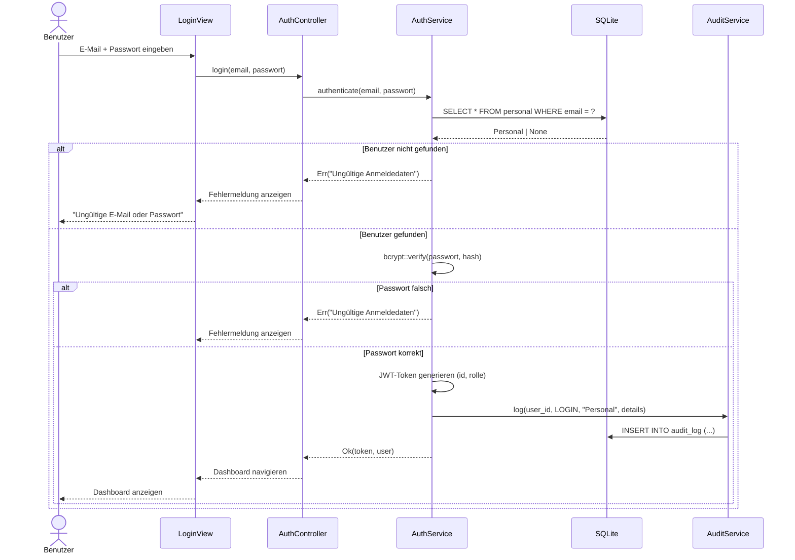
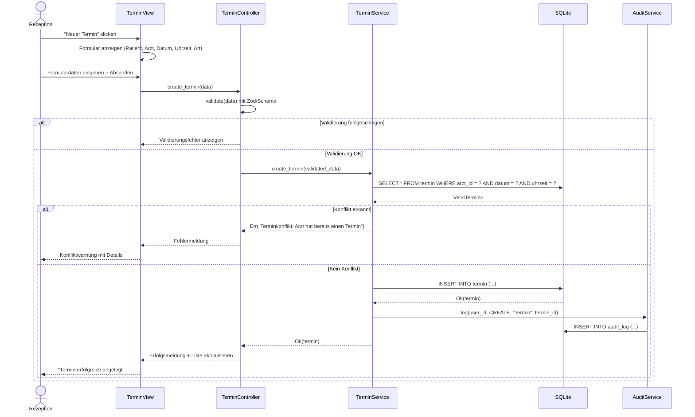
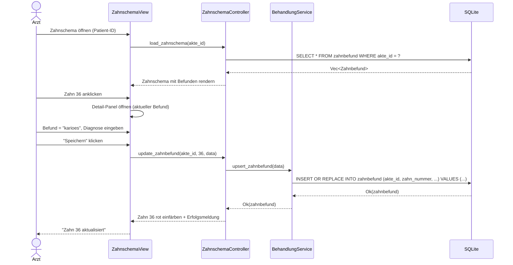
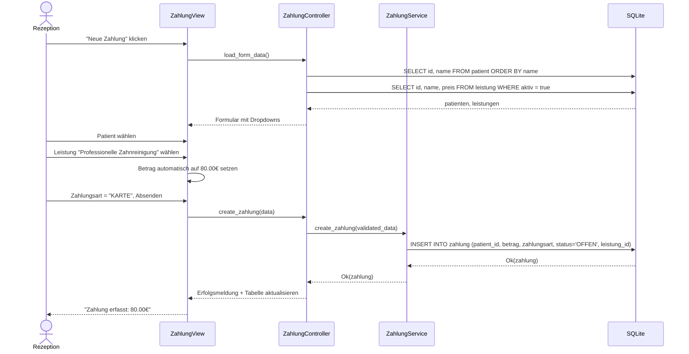
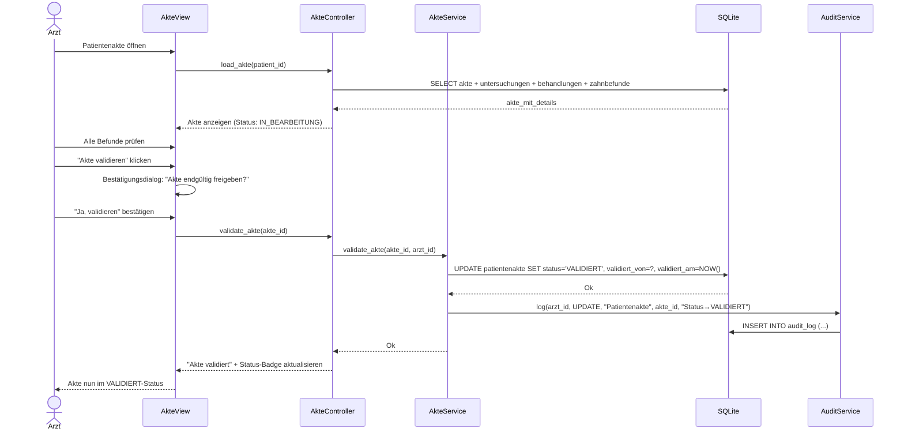

# Sequenzdiagramm (Sequence Diagram) – MeDoc

## Beschreibung
Zeigt die zeitliche Reihenfolge der Interaktionen zwischen Objekten/Komponenten für die wichtigsten Szenarien.

## Szenario 1: Benutzer-Anmeldung (Login)

## Szenario 2: Termin anlegen mit Konflikterkennung

## Szenario 3: Zahnbefund aktualisieren

## Szenario 4: Zahlung erfassen und Leistung zuordnen

## Szenario 5: Patientenakte validieren

