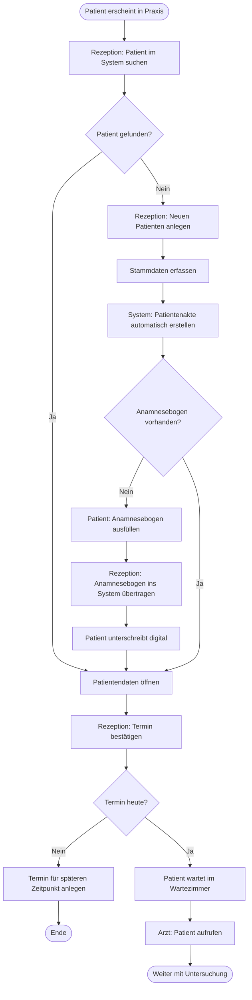
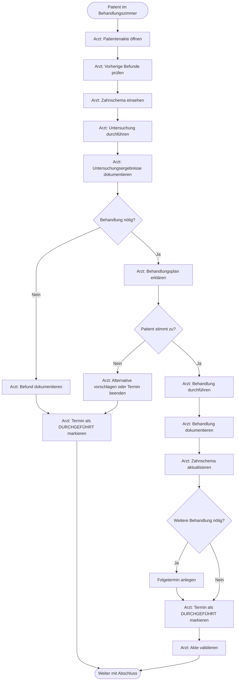
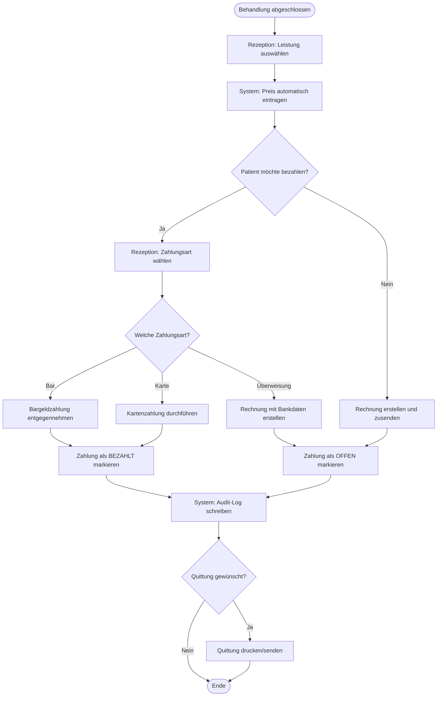
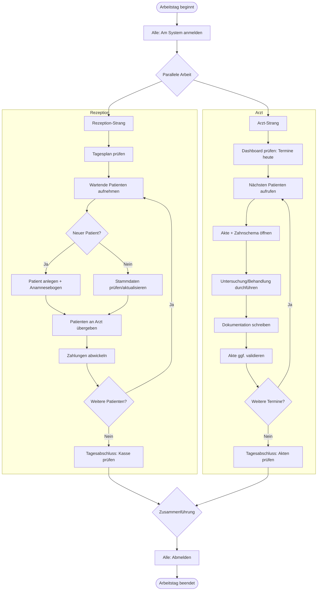
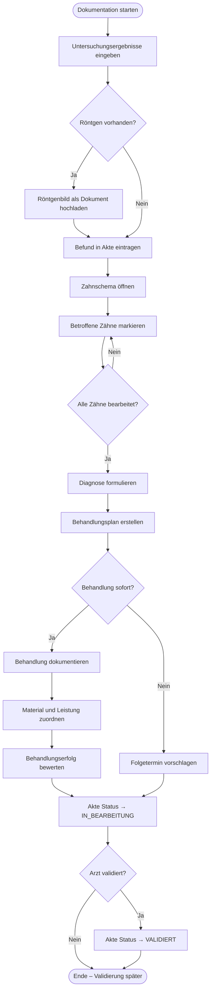

# Aktivitätsdiagramm (Activity Diagram) – MeDoc

## Beschreibung
Modelliert die Geschäftsprozesse und Workflows der Zahnarztpraxis mit Entscheidungspunkten, Parallelaktivitäten und Schleifen.

## Workflow 1: Patientenaufnahme (Neuer Patient)

## Workflow 2: Untersuchung und Behandlung

## Workflow 3: Zahlungsprozess

## Workflow 4: Tagesablauf (Parallele Aktivitäten)

## Workflow 5: Ärztliche Dokumentation (Detailprozess)

