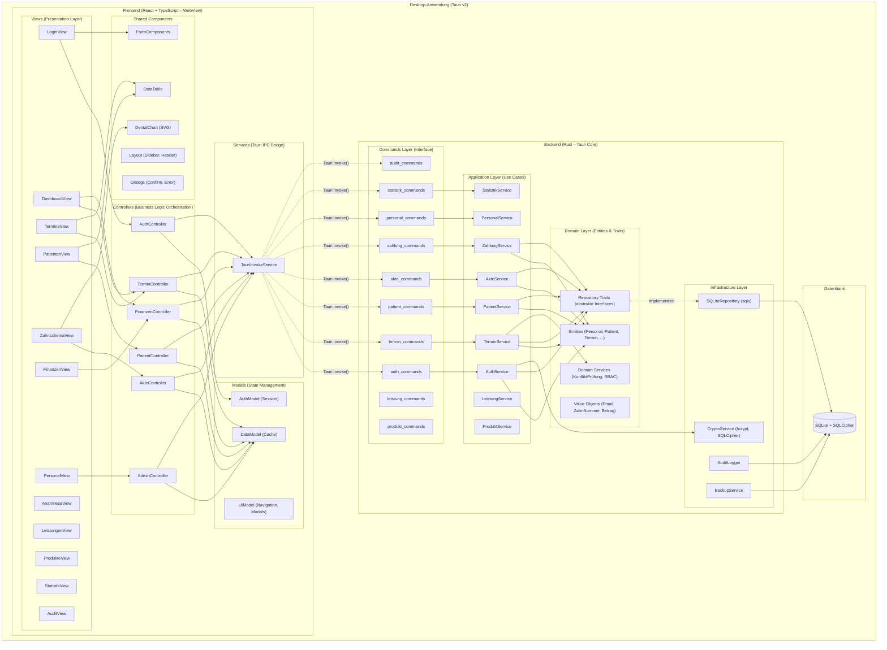

# Komponentendiagramm (Component Diagram) – MeDoc

## Beschreibung
Zeigt die modulare Zerlegung des Systems in Komponenten (Bibliotheken, Module) und ihre Abhängigkeiten.

## Systemkomponenten – Tauri Desktop App

## Komponentenübersicht

| Schicht | Komponente | Technologie | Verantwortung |
|---------|-----------|-------------|---------------|
| **Views** | 12 Seiten-Komponenten | React + TypeScript | UI-Rendering, Benutzerinteraktion |
| **Controllers** | 6 Controller-Module | TypeScript | Geschäftslogik-Orchestrierung, Validierung |
| **Models** | 3 State-Module | Zustand/Jotai | Zustandsverwaltung, Caching |
| **Services** | TauriInvokeService | @tauri-apps/api | IPC-Brücke zum Rust-Backend |
| **Shared** | 5 UI-Bibliotheken | React + SVG | Wiederverwendbare Komponenten |
| **Commands** | 10 Command-Module | Rust (Tauri) | IPC-Endpunkte |
| **Application** | 9 Service-Module | Rust | Use Cases, Geschäftsregeln |
| **Domain** | Entities + Traits | Rust | Datenmodell, Abstraktion |
| **Infrastructure** | 4 Infrastruktur-Module | Rust (sqlx, bcrypt) | DB-Zugriff, Verschlüsselung |
| **Datenbank** | SQLite | SQLCipher | Persistente Datenhaltung |
