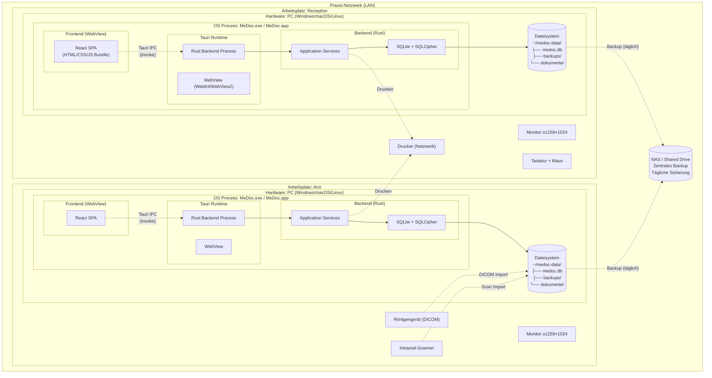

# Verteilungsdiagramm (Deployment Diagram) – MeDoc

## Beschreibung
Zeigt die Zuordnung von Software-Komponenten zu physischer Hardware und wie das System auf einem Desktop-Arbeitsplatz deployrt wird.

## Desktop-Deployment

## Deployment-Konfiguration

### Einzelplatz-Modus (Standard)
Jeder Arbeitsplatz hat eine eigene SQLite-Datenbank. Ideal für kleine Praxen mit 1 Arzt.

| Komponente | Pfad | Beschreibung |
|-----------|------|-------------|
| Anwendung | `/Applications/MeDoc.app` (macOS) | Tauri-Bundle mit Frontend + Backend |
| | `C:\Program Files\MeDoc\MeDoc.exe` (Windows) | |
| Datenbank | `~/medoc-data/medoc.db` | SQLCipher-verschlüsselte SQLite |
| Backups | `~/medoc-data/backups/` | Tägliche automatische Sicherung |
| Dokumente | `~/medoc-data/dokumente/` | Röntgenbilder, Scans, Atteste |
| Logs | `~/medoc-data/logs/` | Application Logs |
| Config | `~/medoc-data/config.toml` | Benutzereinstellungen |

### Mehrplatz-Modus (Optional)
Für Praxen mit 2-3 Arbeitsplätzen: Gemeinsame SQLite-Datenbank auf NAS/Netzlaufwerk.

| Aspekt | Lösung |
|--------|--------|
| Datenbank-Pfad | Konfigurierbar auf Netzlaufwerk |
| Concurrent Access | SQLite WAL-Modus + Optimistic Locking |
| Dateisynchronisation | Gemeinsames Netzlaufwerk für Dokumente |
| Backup | Zentrales NAS-Backup |

## System-Anforderungen

### Minimum

| Ressource | Anforderung |
|-----------|-------------|
| OS | Windows 10+, macOS 12+, Ubuntu 22.04+ |
| CPU | x86_64 oder ARM64 |
| RAM | 4 GB |
| Festplatte | 500 MB (App) + Speicher für Dokumente |
| Display | 1259×1024 Pixel |
| WebView | WebView2 (Windows) / WebKit (macOS/Linux) |

### Empfohlen

| Ressource | Empfehlung |
|-----------|-----------|
| RAM | 8 GB |
| Festplatte | SSD, 10 GB+ für Dokumente |
| Display | Full HD (1920×1080) |
| Netzwerk | LAN für Mehrplatz-Modus |
| Backup | Externes NAS oder USB-Laufwerk |
