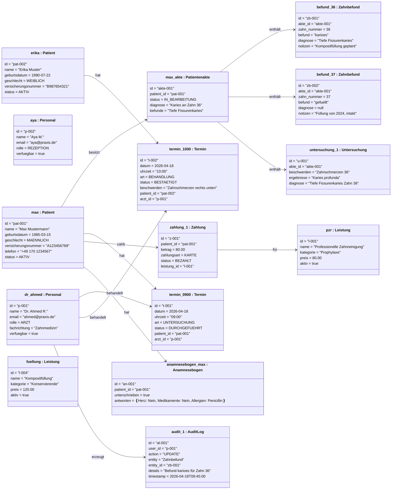

# Objektdiagramm (Object Diagram) – MeDoc

## Beschreibung
Zeigt einen Snapshot der Systeminstanzen (Objekte) zu einem bestimmten Zeitpunkt – hier: Montag 10:15 Uhr, Patient Max Mustermann wird behandelt.

## Szenario: Praxis-Momentaufnahme

## Objektzustand zum Zeitpunkt 10:15 Uhr

| Objekt | Zustand | Beschreibung |
|--------|---------|-------------|
| `dr_ahmed` | Aktiv, behandelt `erika` | 09:00-Termin mit Max abgeschlossen, 10:00 Erika begonnen |
| `aya` | Aktiv, am Empfang | Verwaltet Termine und Zahlungen |
| `max` | AKTIV, Akte IN_BEARBEITUNG | Untersuchung durchgeführt, Karies Zahn 36 festgestellt |
| `erika` | AKTIV, im Behandlungszimmer | 10:00-Termin läuft, Zahnschmerzen rechts unten |
| `termin_0900` | DURCHGEFÜHRT | Max' Kontrolltermin beendet |
| `termin_1000` | BESTAETIGT → wird gerade durchgeführt | Erika wird behandelt |
| `befund_36` | karioes | Heute diagnostiziert, Füllung geplant |
| `befund_37` | gefuellt | Bestehende Füllung von 2024, intakt |
| `zahlung_1` | BEZAHLT | Max hat PZR (80€) per Karte bezahlt |
