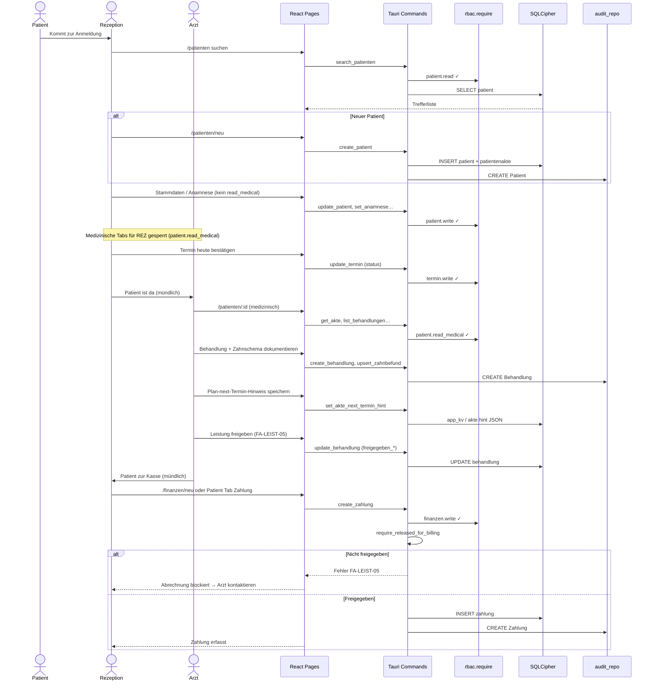
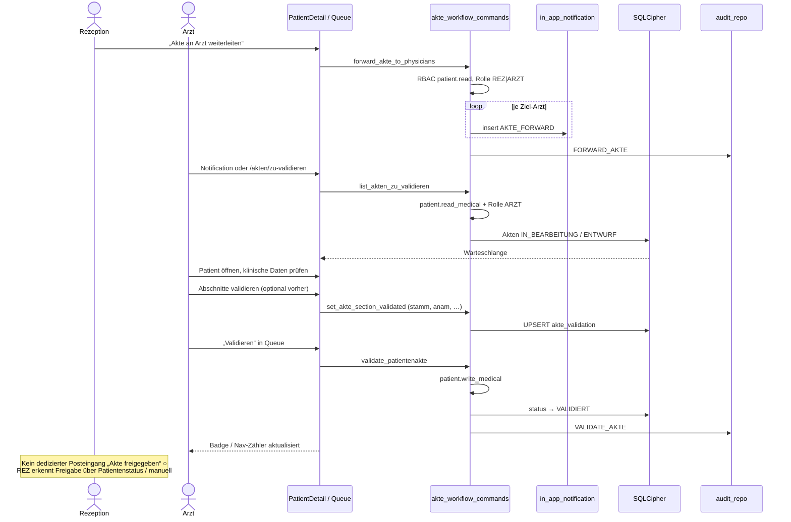
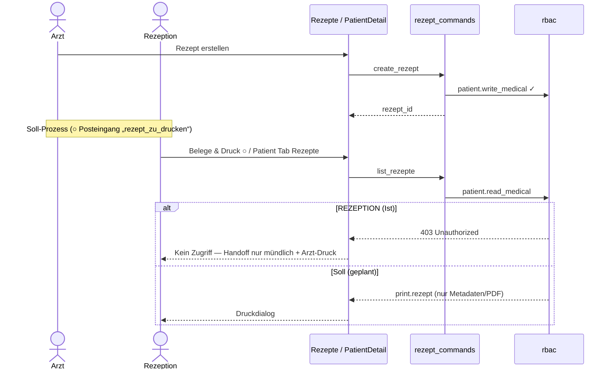
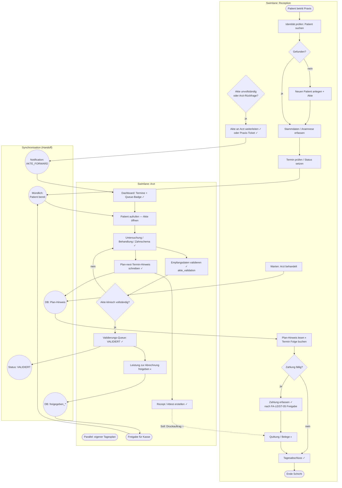

# Arzt ↔ Rezeption — Workflows (Use Case, Sequence, Activity)

**Stand:** 2026-05-21  
**Zweck:** Verbindliche Modellierung der **Zusammenarbeit** zwischen **ARZT** und **REZEPTION** — was heute im Code existiert, was geplant ist, und wo Lücken bleiben.

**Evidence:** `config/rbac.yaml`, `docs/reception-discovery.md`, `akte_workflow_commands.rs`, `akte_validation_commands.rs`, `akte_next_termin_commands.rs`, `domain/services/pricing.rs`, Pflichtenheft FA-AKTE-14/15, FA-LEIST-05/06, WAAD 1.3 / 2.2.

**Erweiterung (Leistung/Preis + Aufgaben):** [`09-aufgaben-leistung-kollaboration.md`](./09-aufgaben-leistung-kollaboration.md) — FA-LEIST-07, FA-AUFG-01..06.

**Legende in Diagrammen**

| Markierung | Bedeutung |
|------------|-----------|
| **✓ Implementiert** | Route/Command im Repo vorhanden |
| **◐ Teilweise** | Vorhanden, aber UX/RBAC/Data-Leakage offen |
| **○ Geplant** | In Discovery/Actions, noch kein dediziertes UI |

---

## 1. Use-Case-Diagramm (Kollaboration)

Fokus: **gemeinsame** und **rollenexklusive** Anwendungsfälle plus **Übergaben** (Handoffs).

```mermaid
flowchart TB
    subgraph Akteure
        REZ["📋 Rezeption<br/>(REZEPTION)"]
        ARZT["🩺 Arzt<br/>(ARZT)"]
        PAT["👤 Patient<br/>(extern)"]
    end

    subgraph System["MeDoc — Kollaborationskern"]
        subgraph Frontdesk["Empfang & Planung"]
            UC01["UC-R01: Patient suchen / anlegen ✓"]
            UC02["UC-R02: Termin anlegen / verschieben / stornieren ✓<br/>«includes» Konfliktprüfung"]
            UC03["UC-R03: Terminstatus setzen ✓<br/>(bestätigt / durchgeführt / nicht erschienen)"]
            UC04["UC-R04: Stammdaten & Anamnese erfassen ✓"]
            UC05["UC-R05: Akte an Arzt weiterleiten ✓<br/>FA-AKTE-14"]
            UC06["UC-R06: Praxis-Ticket an Arzt ✓<br/>FA-PERS-08"]
            UC07["UC-R07: Plan-next-Termin-Hinweis lesen ◐<br/>pro Patient öffnen"]
            UC08["UC-R08: Zahlung erfassen ✓"]
            UC09["UC-R09: Tagesabschluss ✓<br/>unter Verwaltung"]
            UC10["UC-R10: Posteingang / Druck-Warteschlange ○"]
        end

        subgraph Clinical["Ärztliche Verantwortung"]
            UC11["UC-A01: Patientenakte medizinisch öffnen ✓"]
            UC12["UC-A02: Untersuchung / Behandlung dokumentieren ✓"]
            UC13["UC-A03: Zahnschema bearbeiten ✓"]
            UC14["UC-A04: Rezept / Attest erstellen ✓"]
            UC15["UC-A05: Plan-next-Termin-Hinweis schreiben ✓"]
            UC16["UC-A06: Aktenabschnitte validieren ✓<br/>stamm / anam / anlage / zahl"]
            UC17["UC-A07: Akte an Ärzte weiterleiten ✓"]
            UC18["UC-A08: Validierungs-Warteschlange ✓<br/>/akten/zu-validieren FA-AKTE-15"]
            UC19["UC-A09: Patientenakte freigeben ✓<br/>Status → VALIDIERT"]
            UC20["UC-A10: Leistung zur Abrechnung freigeben ◐<br/>FA-LEIST-05"]
            UC21["UC-A11: Offene Buchung auto öffnen ○<br/>FA-LEIST-06"]
            UC24["UC-A12: Audit-Log einsehen ✓"]
        end

        subgraph Shared["Gemeinsam (mit RBAC-Grenze)"]
            UC22["UC-S01: Anmelden ✓"]
            UC23["UC-S02: Dashboard / Tagesplan ✓"]
        end
    end

    PAT -.->|erscheint| REZ
    REZ --> UC01 & UC02 & UC03 & UC04 & UC08 & UC09 & UC22 & UC23
    REZ --> UC05 & UC06 & UC07
    REZ -.->|soll| UC10

    ARZT --> UC02 & UC11 & UC12 & UC13 & UC14 & UC15 & UC16 & UC17 & UC18 & UC19 & UC20 & UC21 & UC24 & UC22 & UC23
    ARZT --> UC05 & UC07

    UC12 -.->|Leistung gespeichert| UC21
    UC21 -.->|offene Buchung| UC08
    UC04 -.->|Handoff: Daten prüfen| UC16
    UC05 -.->|Benachrichtigung| UC18
    UC15 -.->|Handoff: Folgetermin planen| UC02
    UC12 -.->|nach Behandlung| UC20
    UC20 -.->|Freigabe| UC08
    UC14 -.->|Handoff: Ausdruck| UC10
    UC19 -.->|Signal Abrechnung| UC08
```

### Use-Case-Kurztexte (Handoffs)

| ID | Akteur | Handoff an | Beschreibung |
|----|--------|------------|--------------|
| UC-R05 | REZ, ARZT | ARZT (In-App + Audit) | `forward_akte_to_physicians` → Notification `AKTE_FORWARD`; **kein** automatischer Queue-Eintrag ohne Statuswechsel |
| UC-R06 | REZ | ARZT | `create_praxis_ticket` → Ticket + Notification |
| UC-A15 → UC-R02 | ARZT | REZ | `set_akte_next_termin_hint` in SQLite; REZ sieht Hinweis in Aktenkopf / Termin anlegen |
| UC-A16 | ARZT | — | `set_akte_section_validated` — bestätigt Empfangsdaten (Stammdaten/Anamnese) |
| UC-A18/19 | ARZT | REZ (indirekt) | Queue `list_akten_zu_validieren` → `validate_patientenakte` (Status VALIDIERT) |
| UC-A20 → UC-R08 | ARZT | REZ | `freigegeben_von_arzt_id` / `freigegeben_am` auf Behandlung; sonst `pricing::require_released_for_billing` blockiert |
| UC-A11 → UC-R08 | ARZT | REZ | **FA-LEIST-06 (○):** Nach Leistung auf B/U → Tab Abrechnung + offene Buchung `AUSSTEHEND`; REZ übernimmt Zahlung |

---

## 2. Sequenzdiagramme

### 2.1 Tagesablauf: Patient kommt — Rezeption → Arzt → Abrechnung

### 2.2 Akte weiterleiten & ärztlich validieren

### 2.3 Rezept: Arzt erstellt — Rezeption druckt (Soll vs. Ist)

---

## 3. Aktivitätsdiagramm (Swimlanes)

**Ein kompletter Praxisbesuch** mit parallelen Strängen und expliziten **Synchronisationspunkten**.

### Entscheidungstabelle (Rollengrenze)

| Aktivität | Rezeption | Arzt | Technische Absicherung |
|-----------|:---------:|:----:|------------------------|
| Stammdaten schreiben | ✓ | ✓ | `patient.write` |
| Anamnese erfassen | ✓ | ✓ | `patient.write` (kein `write_medical`) |
| Diagnose / Befund / Zahnschema | — | ✓ | `patient.read_medical` / `write_medical` |
| Termin CRUD | ✓ | ✓ | `termin.write` |
| Akte weiterleiten | ✓ | ✓ | `forward_akte_to_physicians` |
| Akte VALIDIERT setzen | — | ✓ | `validate_patientenakte` + Queue nur ARZT |
| Zahlung | ✓ | ✓ | `finanzen.write` + Billing-Release |
| Rezept **autor** | — | ✓ | `write_medical` |
| Rezept **drucken** (Soll) | ✓ | ◐ | **○** eigene Permission `print.rezept` |

---

## 4. Offene Produktentscheidungen (für „exakt definiert“)

Diese Punkte sind **noch nicht** als ein durchgängiger UI-Workflow geschlossen — sie sollten im Pflichtenheft / IA festgezogen werden:

| # | Frage | Optionen | Empfehlung aus Discovery |
|---|--------|----------|---------------------------|
| 1 | **Posteingang** für REZ? | Ein Queue vs. pro-Patient | Zentraler Posteingang (Plan-Hinweis, Druck, „zur Abrechnung“) |
| 2 | **Medizinische Daten** bei Zahlungszuordnung | Voll-Behandlung vs. Billing-DTO | `akte_list_billing` ohne Diagnose/Befund-Text |
| 3 | **REZ sieht Rezepte** | Gar nicht / nur Druck-PDF | `print.rezept` ohne Listen-Detail |
| 4 | **Check-in** | Terminstatus vs. Warteschlange | Optional Wartezimmer-Queue |
| 5 | **Nach VALIDIEREN** | Automatische REZ-Benachrichtigung | Notification `AKTE_FREIGEGEBEN` |

---

## 5. Verwandte Dateien

| Artefakt | Pfad |
|----------|------|
| RBAC | `config/rbac.yaml`, `docs/rbac-matrix.md` |
| Reception Discovery | `docs/reception-discovery.md` |
| IPC Workflow | `apps/practice-host/src/commands/akte_workflow_commands.rs` |
| UI Queue | `apps/practice-host-ui/src/views/pages/akten-zu-validieren.tsx` |
| Billing Release | `apps/practice-host/src/domain/services/pricing.rs`, `apps/practice-host-ui/src/lib/billing-release.ts` |
