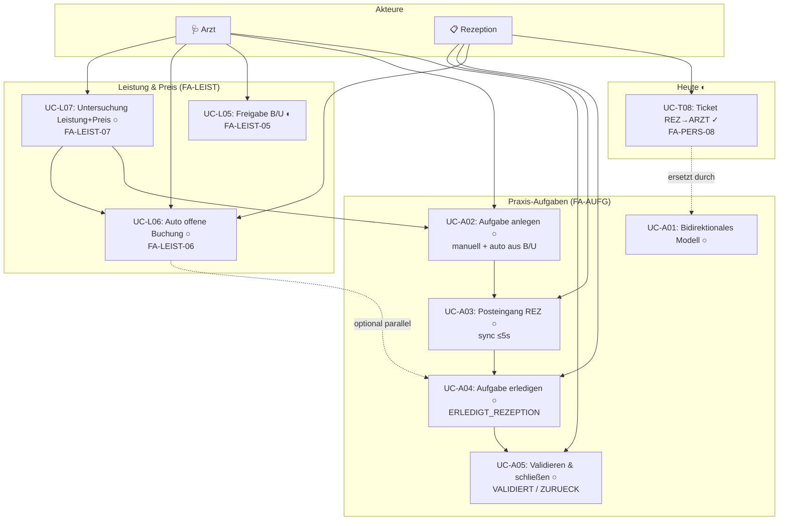
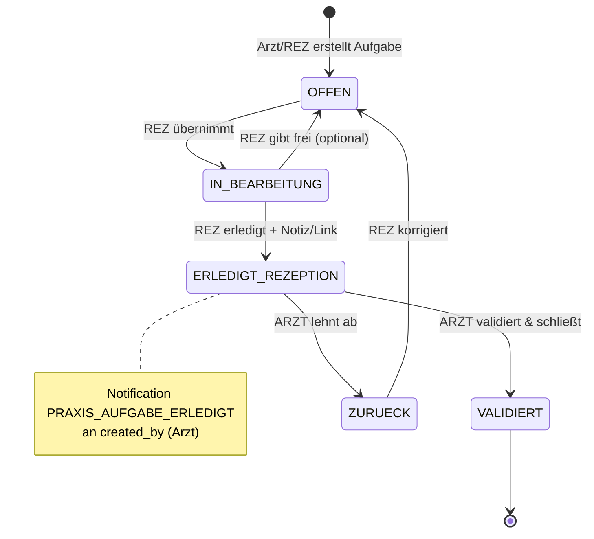
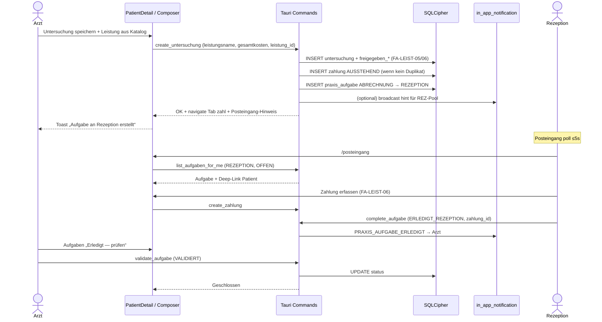
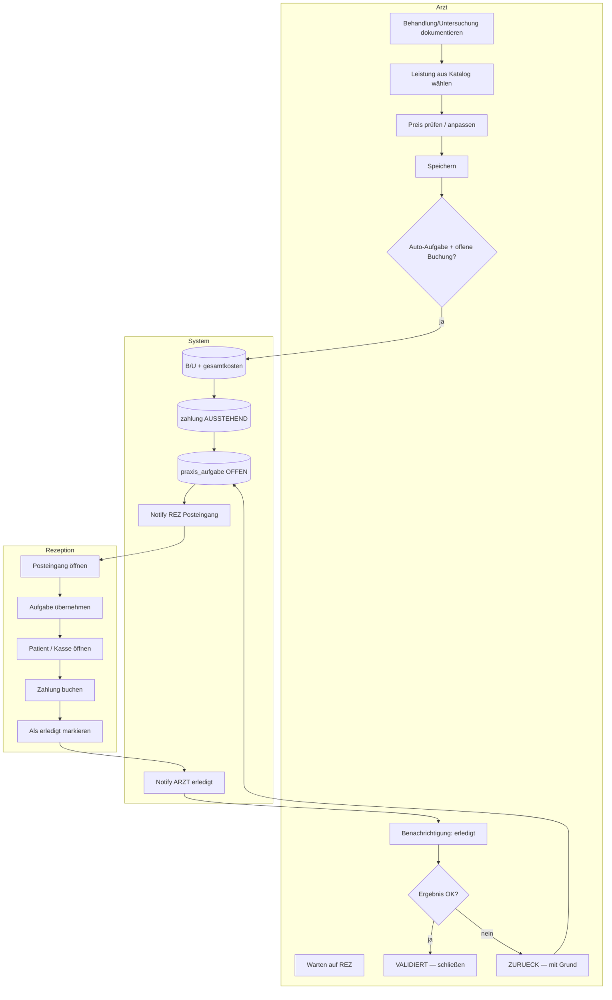

# Aufgaben, Leistung/Preis & Abrechnung — Behavioral Diagrams

**Stand:** 2026-05-21  
**Requirements:** FA-LEIST-06/07, FA-AUFG-01..06 ([`pflichtenheft.md`](../v-model/01-anforderungen/pflichtenheft.md))  
**Related:** [`08-arzt-rezeption-kollaboration.md`](./08-arzt-rezeption-kollaboration.md)

---

## 1. Zielbild (ein Satz)

Wenn der **Arzt** eine **Behandlung** oder **Untersuchung** mit **Leistung und Preis** speichert, entstehen parallel: **(a)** abrechnungsfähige B/U-Daten, **(b)** eine **offene Buchung**, **(c)** eine **Aufgabe für die Rezeption**; die Rezeption erledigt und **benachrichtigt** den Arzt; der Arzt **validiert** und **schließt**.

---

## 2. Use-Case-Diagramm (Soll)

---

## 3. State-Diagramm — Aufgabenstatus (FA-AUFG-06)

---

## 4. Sequenzdiagramm — Arzt speichert Untersuchung mit Leistung (Soll)

---

## 5. Aktivitätsdiagramm — Swimlanes (Soll)

---

## 6. Ist vs. Soll (Evidence)

| Capability | Ist (Code) | Soll (Pflichtenheft) |
|------------|------------|----------------------|
| `untersuchung.gesamtkosten` | ❌ nicht in DB/Entity | FA-LEIST-07 |
| `untersuchung.leistungsname` | ❌ | FA-LEIST-07 |
| Auto Tab `zahl` + `AUSSTEHEND` | ❌ | FA-LEIST-06 |
| Arzt → REZ Aufgabe | ❌ | FA-AUFG-02 |
| REZ Posteingang zentral | ❌ (`/tickets` nur REZ→ARZT sent list) | FA-AUFG-03 |
| REZ erledigt → Notify Arzt | ❌ (Ticket: Arzt schließt allein) | FA-AUFG-04 |
| Arzt VALIDIERT / ZURUECK | ❌ | FA-AUFG-05 |
| `praxis_ticket` | ✓ `akte_workflow_commands.rs` | → FA-AUFG Migration |

---

## 7. Diagramme verbessern — Leitfaden für dieses Projekt

### 7.1 Probleme in den älteren UML-Dateien (`02`–`04`)

| Problem | Empfehlung |
|---------|------------|
| Generische UC-Nummern ohne Requirement-ID | Jedes UC = `FA-*` oder `NFA-*` im Label |
| Nur „Arzt“ / „Rezeption“ ohne **Handoff** | Gestrichelte Kanten mit Verb: „notify“, „validate“, „bill“ |
| Sequenzdiagramme veraltet (bcrypt, kein TOTP) | Kopfzeile **Soll/Ist** + Datei + Command-Namen |
| Kein **Zustandsdiagramm** für Tickets/Aufgaben | FA-AUFG-06 als `stateDiagram-v2` (oben) |
| Activity ohne **System**-Swimlane | Persistenz/Notification in eigener Lane |

### 7.2 Empfohlene Diagramm-Suite pro Feature

Für jedes Kollaborations-Feature **vier Artefakte**:

1. **Use Case (Soll)** — Akteure + FA-IDs + ○/◐/✓  
2. **State Machine** — Status + erlaubte Übergänge (eine Quelle für `workflow_transitions.rs`)  
3. **Sequence (Soll)** — Happy path + 1 Alternativpfad (Fehler Freigabe, ZURUECK)  
4. **Activity (Swimlanes)** — ARZT | REZ | System  

Optional: **Sequence (Ist)** grau/kommentiert — drift sichtbar.

### 7.3 Naming & Traceability

- Dateiname: `09-<feature>-<rolle>.md`  
- Jede Änderung am Pflichtenheft → gleiche IDs in Mermaid-Labels  
- `actions.md` Task-ID (G14–G18) ↔ Diagramm-○  

### 7.4 Technische Sync („direkt synchronisiert“)

| Stufe | Mechanismus | Wann |
|-------|-------------|------|
| **MVP** | REZ poll `list_aufgaben_for_me` alle 5 s + `medoc-nav-badges-refresh` Event nach Mutation | FA-AUFG-03 |
| **Besser** | Gleicher Event nach IPC `complete_aufgabe` (FE all tabs) | G17 |
| **Später** | LAN-SSE/WebSocket nur für Posteingang | NFA-NET Erweiterung |

### 7.5 Produktverbesserungen (über Diagramme hinaus)

1. **Ein Posteingang** statt Tickets + Plan-Hinweis + Druck verteilt — reduziert REZ-Kognitive Last (siehe `reception-discovery.md`).  
2. **Aufgaben-Typen** mit Deep-Links: `ABRECHNUNG` → Tab `zahl` + `aufgabe_id`; `TERMIN` → `/termine/neu?patient=`  
3. **Leistungs-Snapshot** auf Aufgabe (nicht nur live B/U) — Historie bleibt korrekt wenn Arzt später Preis ändert.  
4. **SLA-Badge** „seit 15 min offen“ auf Posteingang-Zeilen.  
5. **Diagramm-CI:** Vitest-Snapshot oder `mermaid-cli` render in `docs/uml/out/` bei PR (optional).  

---

## 8. Implementation backlog (actions.md)

| ID | Scope |
|----|--------|
| G14 | FA-LEIST-06 auto billing |
| G15 | FA-LEIST-07 Untersuchung schema + UI + pricing |
| G16 | FA-AUFG-01/06 model + transitions |
| G17 | FA-AUFG-02–05 Posteingang + notify + validate UI |
| G18 | Migrate `praxis_ticket` → `praxis_aufgabe` |
