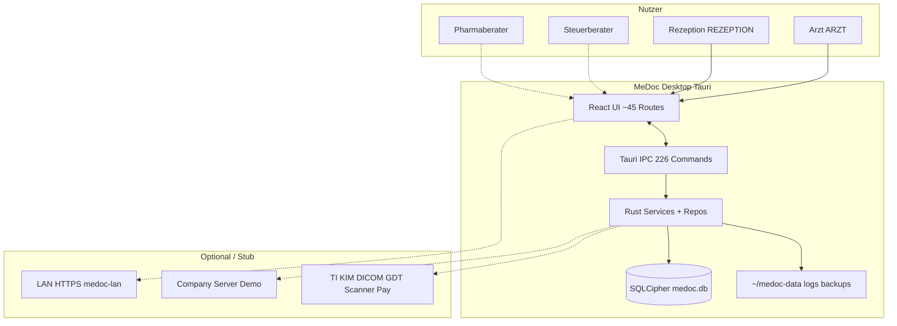
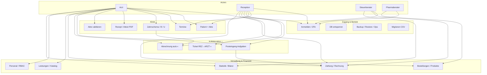
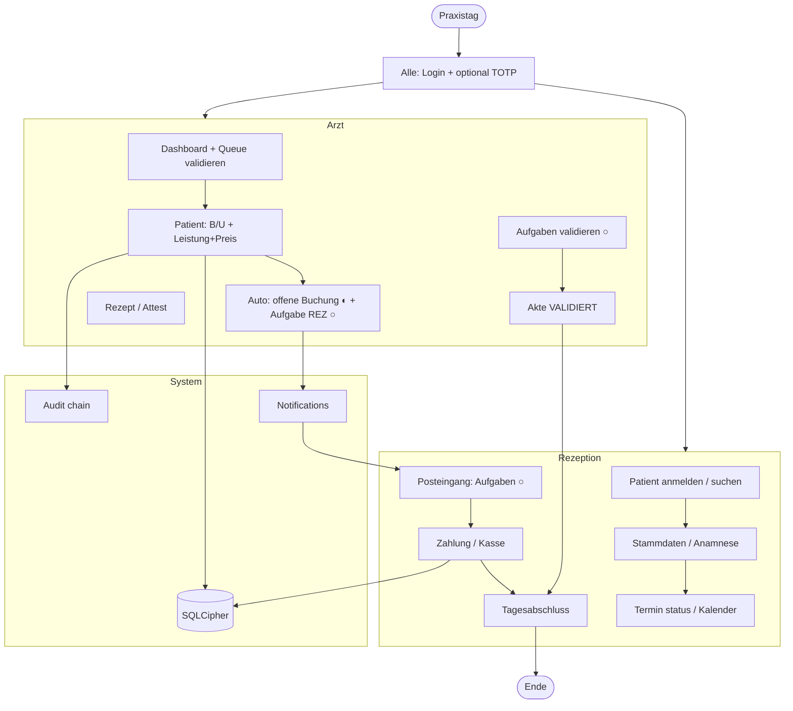
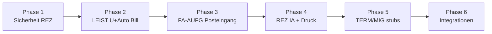

# MeDoc — Master Feature & Workflow Audit

**Stand:** 2026-06-02 (reconciled with G14–G19, G21, multi-device e2e)  
**Ziel:** Vollständige Abbildung von **Pflichtenheft (FA/NFA)** ↔ **Implementierung (Routes + IPC)** ↔ **Behavioral Diagrams**, inkl. **Lücken, Widersprüche und Umsetzungsroadmap**.

**Quellen (gelesen / `rg`):**  
`docs/v-model/01-anforderungen/pflichtenheft.md`, `app/src/App.tsx`, `app/src-tauri/src/commands/register.rs` (226 IPC), `config/rbac.yaml`, `docs/definition-of-done-pages.md`, `docs/reception-discovery.md`, `docs/requirements-engineering/06-validierung.md`, `app/src/lib/integration-capabilities.ts`, `docs/uml/08-*.md`, `docs/uml/09-*.md`.

**Legende Status**

| Symbol | Bedeutung |
|--------|-----------|
| ✅ | Akzeptanzkriterium im Wesentlichen erfüllt (Code + Tests oder klarer IPC-Pfad) |
| 🟡 | Teilweise — Kern vorhanden, Workflow-Lücke, Rolle, UX oder E2E fehlt |
| 🔴 | Nicht umgesetzt oder nur Pflichtenheft |
| ⚪ | Organisatorisch / bewusst Stub / außerhalb Desktop-Kern |
| ❌ | Widerspruch Doc ↔ Code |

---

## 1. Systemkontext (alle Akteure & Kanäle)

---

## 2. Feature-Inventar (Domain → Route → Requirement → Status)

### 2.1 Zugang & Plattform

| Domain | Route / Modul | FA / NFA | IPC (Auszug) | Status | Gap / Problem |
|--------|---------------|----------|--------------|--------|----------------|
| Login / Session | `/login` | FA-AUTH-01..04, NFA-SEC-03 | `login`, `logout`, `get_session`, TOTP | ✅ | ARZT TOTP Pflicht; Brute-Force ✅ |
| DB Setup | `DbSetupGate` | NFA-SEC-08 | `get_db_setup_status`, `provision/unlock` | ✅ | — |
| Einstellungen | `/einstellungen` | FA-EINST, FA-PAY, FA-LIC | portal, LAN, praxis KV, password | 🟡 | Abo-Zahlung über Company-Demo; kein Live-Stripe |
| Ops | `/ops` | NFA-SEC-05 | `create/list/restore_backup`, DSGVO | ✅ | Restore UI (G2) |
| Compliance / DSGVO | `/datenschutz`, `/compliance` | NFA-DATA | `dsgvo_*`, `generate_vvt/dsfa` | 🟡 | VVT-Text kann Runtime hinterherhinken |
| Migration | `/migration` | FA-MIG-01..10 | `import_patients_csv`, wizard UI | 🟡 | VDDS/BDT vollständig **🔴**; CSV ✅ |
| Feedback | `/feedback` | — | `submit_feedback` | ✅ | — |
| Hilfe | → Einstellungen tab | NFA-USE | — | 🟡 | Kein dediziertes Hilfe-CMS |

### 2.2 Termine & Praxisplanung

| Domain | Route | FA | Status | Gap |
|--------|-------|-----|--------|-----|
| Kalender | `/termine`, `/termine/neu` | FA-TERM-01..16 | 🟡 | Konflikt, Status, Farben ✅; **FA-TERM-11** SMS/E-Mail **🔴**; **FA-TERM-04** Notfall-Toolbar **Feature-Flag aus** (CAL2) |
| Planung | `/verwaltung/arbeitstage`, `praxisplanung`, `arbeitszeiten`, `sonder-sperrzeiten` | FA-TERM-06, FA-PERS | ✅ | — |
| Dashboard Termine | `/` | FA-TERM, G9 | 🟡 | Upcoming panel ✅; keine Check-in-Queue |

### 2.3 Patienten & Akte

| Domain | Route | FA | Status | Gap |
|--------|-------|-----|--------|-----|
| Patientenliste | `/patienten`, `/patienten/neu` | FA-PAT-01..11 | ✅ | Fuzzy-Suche ✅ |
| Patientenakte | `/patienten/:id` (Tabs) | FA-AKTE, FA-ZAHN, FA-DOK | 🟡 | Tabs ✅; **FA-AKTE-03** Versionierung **🟡**; Timeline **🟡** |
| Validierung Queue | `/akten/zu-validieren` | FA-AKTE-15 | ✅ | Badge + IPC ✅ |
| Weiterleitung | Dialog in Akte | FA-AKTE-14 | 🟡 | Notification ✅; Queue-Eintrag nicht automatisch |
| Vollständigkeit | Aktenkopf | FA-AKTE-16 | 🟡 | `akte-completeness.ts` ✅ |
| Zahnschema | Tab in Akte | FA-ZAHN-01..07 | ✅ | — |
| Untersuchung | Composer | FA-DOK-01, FA-LEIST-07 | 🟡 | Klinisch ✅; **kein leistungsname/gesamtkosten** **🔴** |
| Behandlung | Tab Behandlung | FA-DOK-02, FA-LEIST-02 | ✅ | Leistung+Preis ✅ |
| Anlagen / Scan | Tab Anlage | FA-DOK-06/07, FA-DEV | 🟡 | Upload ✅; Scanner Stub |
| Rezept / Attest | Tabs + `/rezepte` `/atteste` | FA-REZ, FA-ATT | ✅ | REZ list **❌** RBAC vs patient-detail load |

### 2.4 Finanzen & Leistungen

| Domain | Route | FA | Status | Gap |
|--------|-------|-----|--------|-----|
| Zahlungen | `/finanzen`, `/finanzen/neu`, Akte Tab `zahl` | FA-FIN-01..11, FA-LEIST-05 | 🟡 | CRUD ✅; Freigabe B/U ✅ |
| Auto offene Buchung | nach Behandlung save | FA-LEIST-06 | ✅ | Behandlung + Untersuchung (`ensure_open_booking_for_billable_*`, G14/G15) |
| Untersuchung Preis | — | FA-LEIST-07 | ✅ | Schema + `UntersuchungBillingFields` + zahl tab (G15); live UI **NOT OBSERVED** |
| Leistungskatalog | `/leistungen`, verwaltung | FA-LEIST-01..04 | ✅ | — |
| GOZ Rechnung PDF | verwaltung finanz-werkzeuge | FA-FIN-06, FA-AKTE-06 | ✅ | Praxis completeness gate |
| Bilanz | `/bilanz` | FA-FIN-07..10 | ✅ | Snapshots |
| Tagesabschluss | `.../tagesabschluss` | FA-FIN-02 | ✅ | Sidebar + native Go menu (GAP-10, 2026-06-02); live UI **NOT OBSERVED** |
| Statistik | `/statistik` | FA-STAT, WAAD 9.5 | 🟡 | Charts ✅; Krankheitsbild Proxy |

### 2.5 Kollaboration Arzt ↔ Rezeption

| Domain | Route | FA | Status | Gap |
|--------|-------|-----|--------|-----|
| Tickets | `/tickets` | FA-PERS-08 | 🟡 | Legacy REZ→ARZT; banner → Posteingang (G20) |
| Aufgaben | `/posteingang` | FA-AUFG-01..06 | ✅ | Bidirektional + notify + poll (G16–G19); live Tauri **NOT OBSERVED** |
| Plan-next-Termin | Aktenkopf | NFA-USE / WAAD | 🟡 | SQLite ✅; REZ tab guards + redaction (GAP-01 mitigated) |
| Benachrichtigungen | Header / Dashboard | — | ✅ | `PRAXIS_AUFGABE_ERLEDIGT` popover + Posteingang queue |

### 2.6 Personal, Lager, Verträge

| Domain | Route | FA | Status |
|--------|-------|-----|--------|
| Personal | `/personal` | FA-PERS-01..07 | ✅ Overrides ✅ |
| Produkte / Bestellungen | `/produkte`, `/bestellungen` | FA-PROD | 🟡 REZ kann Bestellungen anlegen (Policy-Mismatch) |
| Verwaltung Hub | `/verwaltung/*` | diverse | ✅ |
| Audit | `/audit` | NFA-SEC-04 | ✅ ARZT only |
| LAN Host | Einstellungen | NFA-NET | ✅ TLS fingerprint |

### 2.7 Integrationen (Stubs)

| ID | FA / NFA | Status | Evidence |
|----|----------|--------|----------|
| E-Rezept / KIM | FA-DEV | 🔴 Stub | `integration-capabilities.ts` `available: false` |
| DICOM / GDT / Scanner | FA-MIG-04, FA-DEV | 🟡 | `inspect_dicom`, `parse_gdt` — kein Live |
| Kartenzahlung | FA-FIN | 🔴 | `process_payment` stub |
| Company Portal | FA-PAY / LIC | 🟡 | `_demo` flag |

**Zählung (Pflichtenheft):** ~**91 FA** + **18 NFA** — grob **~65–70% MUST-FA** mit Code-Spur ✅/🟡, **~15%** 🔴, Rest SHOULD/NICE.

---

## 3. Master Use-Case-Diagramm (alle Domänen)

---

## 4. End-to-End Activity — Praxistag (Soll-Zielbild)

---

## 5. Kritische Sequenzen (Ist vs. Soll)

### 5.1 Abrechnung nach Behandlung (◐ implementiert)

| Schritt | Ist | Soll |
|---------|-----|------|
| Arzt speichert Behandlung + Leistung | ✅ `ensure_open_booking_for_billable_behandlung` | ✅ |
| Tab `zahl` öffnen | ✅ `openZahlTabAfterBillableBehandlung` | ✅ |
| Gleiches für **Untersuchung** | ✅ | FA-LEIST-07 + erweitern LEIST-06 |
| Aufgabe an REZ | ✅ | FA-AUFG-02 (`ensure_abrechnung_aufgabe_for_clinical_line`, manual dialog) |

### 5.2 Aufgabenzyklus (✅ implementiert, live smoke pending)

Siehe [`09-aufgaben-leistung-kollaboration.md`](./09-aufgaben-leistung-kollaboration.md) State + Sequence. Automated coverage: `collaboration-g21.test.ts`, `posteingang.smoke.test.tsx`, `praxis_aufgabe_tests.rs`.

### 5.3 Rezeption ohne Medizin (❌ Widerspruch)

| Anforderung | Code-Ist | Problem |
|-------------|----------|---------|
| NFA-SEC-02 REZ kein medical write | ✅ `write_medical` denied | OK |
| REZ keine Diagnose sehen | 🟡 `get_akte` redacted | OK |
| REZ Zahlung Zuordnung | 🟡 mitigated | `redact_*_for_rezeption` + unit tests (`gap01`); live REZ audit **NOT OBSERVED** |
| REZ Rezept-Tab | 🟡 mitigated | `canViewClinical` tab guards; live REZ audit **NOT OBSERVED** |

---

## 6. Gap-Register (priorisiert)

### P0 — Sicherheit / Workflow-Bruch

| ID | Gap | FA | Fix |
|----|-----|-----|-----|
| GAP-01 | REZ sieht klinische Texte in Behandlung-Listen für Zahlung | NFA-SEC-02 | **Mitigated** — `rezeption_redact.rs` + tests; live audit pending |
| GAP-02 | REZ patient-detail lädt Rezepte/Atteste (medical IPC) | FA-REZ/ATT | **Mitigated** — tab guards; live audit pending |
| GAP-03 | Kein Posteingang; verteilte Signale | FA-AUFG-03 | **Done** — `/posteingang` + poll + nav (G17) |
| GAP-04 | Arzt→REZ Aufgaben fehlen | FA-AUFG-02..05 | **Done** — `praxis_aufgabe` + notify (G16–G19) |

### P1 — Abrechnung & Leistung (Ihr Fokus)

| ID | Gap | FA | Fix |
|----|-----|-----|-----|
| GAP-05 | Untersuchung ohne `gesamtkosten`/`leistungsname` | FA-LEIST-07 | **Done** (G15) |
| GAP-06 | LEIST-06 nur Behandlung | FA-LEIST-06/07 | **Done** (G14/G15) |
| GAP-07 | Auto-Aufgabe ABRECHNUNG bei Leistung | FA-AUFG-02, G18 | **Done** (G18) |

### P2 — UX / Vollständigkeit MUST

| ID | Gap | FA | Fix |
|----|-----|-----|-----|
| GAP-08 | Termin SMS/E-Mail | FA-TERM-11 | Notification pipeline (deferred ok if SHOULD) |
| GAP-09 | Notfall-Termin <3 Klicks | FA-TERM-04 | Flag default or restore toolbar |
| GAP-10 | REZ Tagesabschluss nicht in Sidebar | FA-FIN-02 | **Done** — `nav-sections.ts` + `NAV_ITEM_DEFINITIONS` (2026-06-02) |
| GAP-11 | Quittung aus Zahlung dediziert | FA-AKTE-06 | **Done** — `/finanzen` + Patientenakte Tab `zahl` via `quittung-export-flow.ts` (2026-06-02) |
| GAP-12 | VDDS/BDT Migration | FA-MIG-01/02 | Parser + wizard steps |

### P3 — Stubs / später

| ID | Gap | FA |
|----|-----|-----|
| GAP-13 | TI/KIM/E-Rezept live | FA-DEV |
| GAP-14 | Mobile REZ feature parity LAN | NFA-NET-05 |
| GAP-15 | Abo payment production | FA-PAY |

---

## 7. Doc ↔ Code Mismatches

| # | Dokument sagt | Code sagt | Severity |
|---|---------------|-----------|----------|
| M1 | `06-validierung.md` viele Gruppen ✅ | WAAD-Matrix 🟡/🔴 für LEIST/AUFG | **Resolved 2026-06-02** — LEIST/AUFG done; doc rows updated |
| M2 | `architecture-design.md` SQLCipher „ausstehend“ | `sqlcipher.rs` + `DbSetupGate` ✅ | Mittel — Archivdoc |
| M3 | ISO doc REZ „medizinisch lesen“ | Produktziel: REZ minimiert | **Hoch** — Policy |
| M4 | FA-PERS-08 = vollständiges Ticket-System | Nur REZ→ARZT, kein VALIDIERT durch Arzt nach REZ | Mittel |
| M5 | FA-AKTE-14 → Validierungs-Queue | Nur `AKTE_FORWARD` Notification | Niedrig |
| M6 | `register.rs` 226 vs ältere Docs „224“ | Drift | Niedrig |

---

## 8. Umsetzungsroadmap (Workflow komplett schließen)

Empfohlene **Serienfolge** (jede Phase = Diagramm in `09`/`10` auf ✅ aktualisieren + Tests):

| Phase | Actions | FA | Ergebnis |
|-------|---------|-----|----------|
| **1** | GAP-01/02 billing DTO + patient load guard | NFA-SEC-02 | REZ sicher an Kasse |
| **2** | G15, G14 extend, GAP-05/06 | FA-LEIST-06/07 | B+U → Zahlung konsistent |
| **3** | G16, G17, G18 | FA-AUFG-01..06 | Arzt↔REZ geschlossener Loop |
| **4** | Posteingang nav, print queue, tagesabschluss nav | FA-AUFG-03, reception IA | REZ-Tagesworkflow |
| **5** | Notfall flag, SMS stub honest, migration profiles | FA-TERM, FA-MIG | MUST-Lücken reduzieren |
| **6** | Integration capability truth + LAN mobile | NFA-NET, FA-DEV | Keine falschen Live-Buttons |

**Ledger:** `docs/coordination/actions.md` — G14–G19 **Done**; GAP-10 **Done** (2026-06-02).

---

## 9. Diagramm-Pflege (alle Features abdecken)

| Diagramm-Datei | Abdeckung |
|----------------|-----------|
| [`02-use-case-diagram.md`](./02-use-case-diagram.md) | Legacy generisch — **ersetzen durch §3 hier** für Reviews |
| [`03-sequence-diagram.md`](./03-sequence-diagram.md) | Veraltet (bcrypt) — Soll-Sequenzen in **§5 + 09** |
| [`04-activity-diagram.md`](./04-activity-diagram.md) | Generisch — **§4** ist Praxistag-Soll |
| [`08-arzt-rezeption-kollaboration.md`](./08-arzt-rezeption-kollaboration.md) | Rolle ARZT/REZ Handoffs |
| [`09-aufgaben-leistung-kollaboration.md`](./09-aufgaben-leistung-kollaboration.md) | LEIST-06/07 + AUFG |
| **Dieses Dokument `10`** | **Master** Inventar + Gaps + Roadmap |

**Regel:** Jede geschlossene GAP-* → Status in §2 + Legende ○→✅ + `06-validierung.md` WAAD-Zeile anpassen.

---

## 10. Nächster Implementierungsschritt

Wenn das Ziel „**kompletter Workflow implementieren**“ ist, starten Sie mit **Phase 1 + 2** (höchster Nutzen, geringstes Risiko):

1. `akte_list_billing` + REZ-safe patient detail load  
2. `untersuchung` migration + LEIST fields + `ensure_open_booking` für U  
3. Dann **Phase 3** `praxis_aufgabe` (kleinster Vertical Slice: nur `ABRECHNUNG`-Typ)

Sagen Sie, welche Phase als erstes codiert werden soll — die Anforderungen und Diagramme sind dafür vorbereitet.
